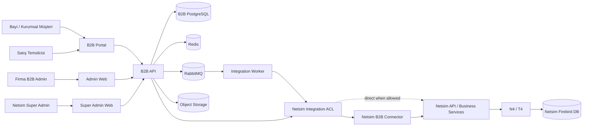
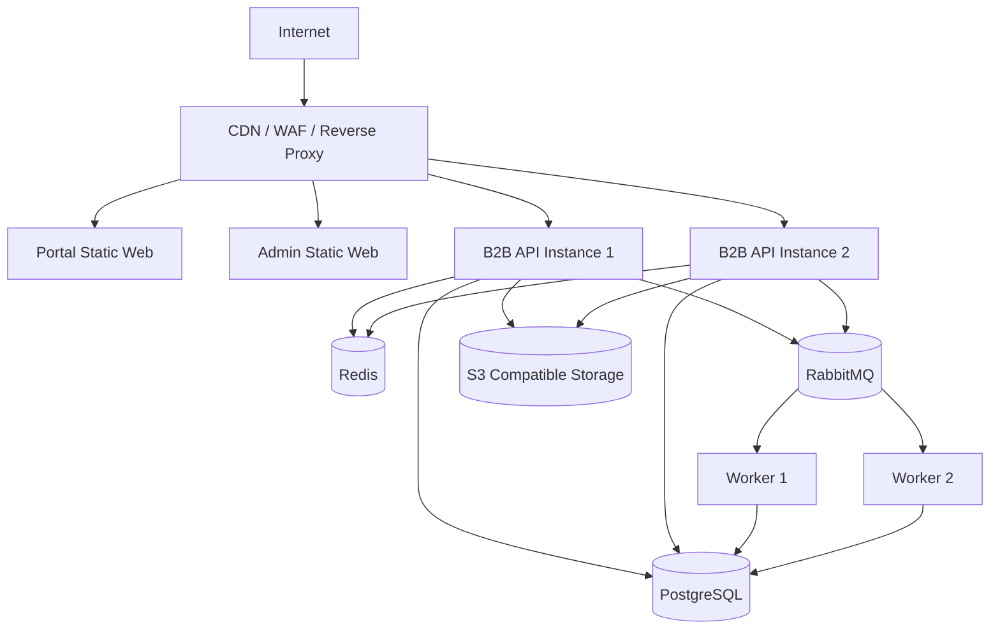
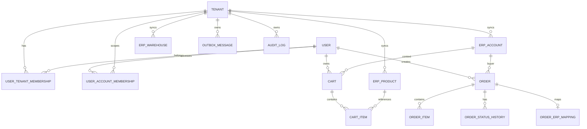
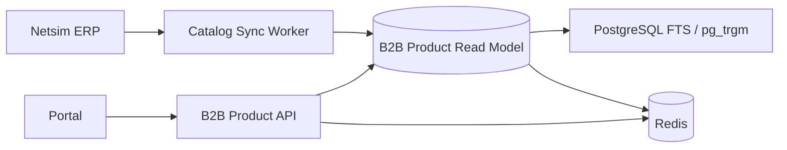
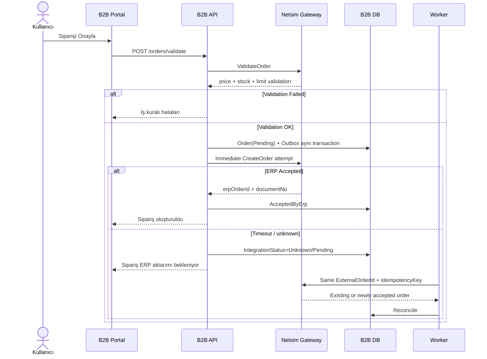
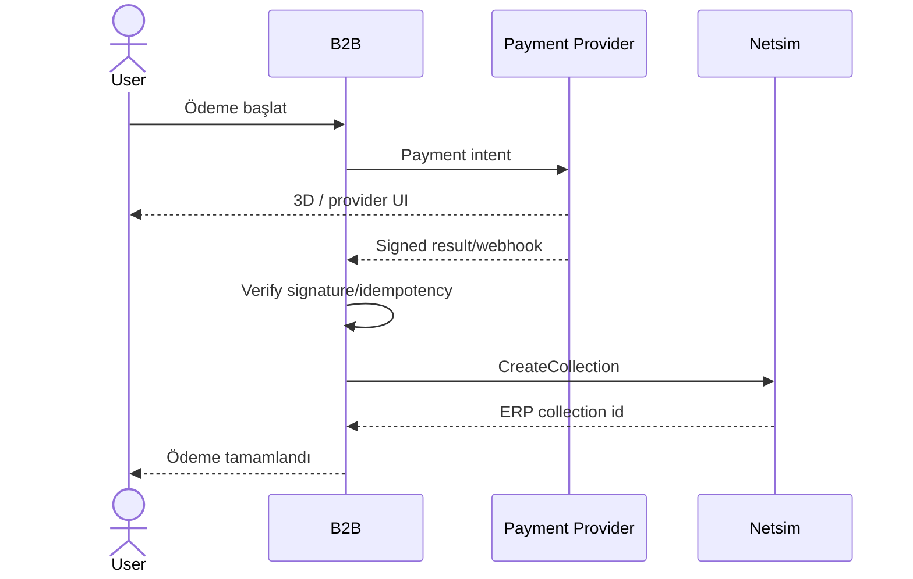
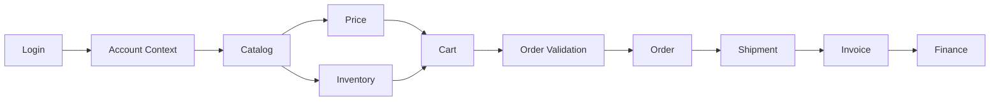
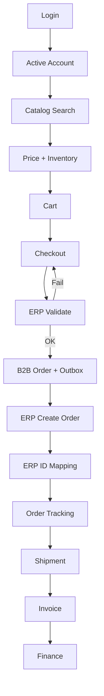

# NETSİM B2B NEXT — CURSOR MASTER IMPLEMENTATION SPEC

> **Belge türü:** Ürün + Teknik Mimari + Veri Modeli + Entegrasyon Sözleşmesi + UI/UX + Güvenlik + Test + DevOps + Cursor Uygulama Planı  
> **Sürüm:** 1.0  
> **Tarih:** 09.09.2026  
> **Dil:** Türkçe  
> **Hedef:** Bu dosya repository köküne konulduğunda Cursor/AI coding agent, Netsim B2B projesini mimari kararları bozmadan fazlar halinde geliştirebilmelidir.

---

# 0. CURSOR İÇİN EN ÜST SEVİYE TALİMAT

Bu belge **projenin ana teknik sözleşmesidir**.

Cursor bu projeyi geliştirirken:

1. Önce bu dosyanın tamamını oku.
2. Mevcut repository içindeki `docs/` klasörünü de incele.
3. Bu belgede **KESİN KARAR**, **ZORUNLU**, **YASAK**, **SOURCE OF TRUTH** olarak belirtilen kuralları değiştirme.
4. Netsim API'nin gerçek endpoint isimleri verilmeden endpoint uydurma.
5. Gerçek Netsim endpointleri gelene kadar provider interface + mock/fake provider kullan.
6. Netsim ERP transactional tablolarına doğrudan `INSERT`, `UPDATE`, `DELETE` yazma.
7. Netsim veritabanı şeması yalnızca:
   - veri anlamını,
   - mapping'i,
   - API yeterliliğini,
   - iş kurallarını
   anlamak için referanstır.
8. Frontend'in hiçbir yerinde `STOKKART`, `CARIKART`, `ALSAASIL`, `FIYADETA` gibi ERP tablo adları kullanma.
9. B2B domain dili kullanıcı odaklı olmalıdır:
   - `STOKKART` → `Product`
   - `CARI` → `Account` / `Customer`
   - `ALISSATIS` → `Order`
   - `CARIISLM` → `AccountTransaction`
10. Her faz sonunda:
    - build,
    - lint,
    - unit test,
    - integration test,
    - gerekli ise E2E test
    çalıştır.
11. Bir faz tamamlanmadan sonraki faza büyük çapta geçme.
12. TODO bırakılacaksa sebebini kodda ve `docs/implementation-status.md` içerisinde açıkça yaz.
13. Sahte başarı durumu üretme. ERP işlemi Netsim tarafından doğrulanmamışsa kullanıcıya “başarılı” gösterme.
14. Multi-tenant izolasyonunu yalnız frontend filtresi olarak uygulama; backend sorgularında ve authorization katmanında zorunlu tut.
15. Finans, fiyat, stok, limit, sipariş gibi kritik verilerde “cache varsa doğru kabul et” yaklaşımı kullanma; ilgili kurallara göre canlı doğrulama yap.
16. Cursor herhangi bir mimari belirsizlik gördüğünde:
    - önce bu belge,
    - sonra repository `docs/`,
    - sonra Netsim API sözleşmesi
    sırasıyla referans almalıdır.

---

# 1. PROJE TANIMI

## 1.1 Ürün

Ürünün çalışma adı:

**Netsim B2B Next**

Netsim B2B Next, Netsim N4/T4 kullanan firmaların bayi ve kurumsal müşterilerine:

- ürün,
- kategori,
- fiyat,
- stok,
- satılabilir stok,
- teklif,
- sipariş,
- sipariş takibi,
- sevkiyat,
- irsaliye,
- fatura,
- cari hesap,
- finans,
- ödeme,
- kampanya,
- bildirim,
- iade,
- teknik servis

işlevlerini web üzerinden sunan yeni nesil bir B2B platformudur.

## 1.2 Bu proje ne değildir?

Bu proje:

- N4'ün web kopyası değildir.
- T4'ün web kopyası değildir.
- ERP yönetim ekranlarının yeniden yazılması değildir.
- Yeni bir muhasebe sistemi değildir.
- Yeni bir stok ERP sistemi değildir.
- Netsim fiyat motorunun alternatifi değildir.
- Netsim veritabanını tamamen kopyalayan ikinci ERP değildir.

## 1.3 Ana fikir

```text
Netsim ERP = Ticari gerçeklik
B2B Domain = Ticari gerçekliğin müşteri açısından anlamı
B2B UX     = Kullanıcının bu anlamı en kolay şekilde kullanması
```

Örnek:

```text
Netsim:
Fiziki stok  = 100
Rezerv       = 80

B2B Domain:
availableQuantity = 20

UI:
"Stokta 20 adet"
```

---

# 2. KAYNAK DOKÜMANLAR

Bu master spec aşağıdaki bilgi setlerinin birleştirilmiş halidir.

## 2.1 Mevcut NetsimB2B repository

Repository:

`https://github.com/NetsimB2B/NetsimB2B`

Özellikle referans alınan bölümler:

```text
docs/
├── 00-project/
│   ├── PROJE_KAPSAMI.md
│   ├── PROJE_VİZYONU.md
│   └── TERİMLER_SÖZLÜĞÜ.md
├── 01-product-architecture/
│   ├── KULLANICI_TİPLERİ.md
│   └── UYGULAMA_MİMARİSİ.md
├── 02-ui-ux/
│   ├── TASARIM_SİSTEMİ.md
│   └── UX_PRENSİPLERİ.md
├── 03-modules/
│   ├── gösterge-paneli.md
│   ├── hızlı-sipariş.md
│   └── sepet.md
├── 04-data/
│   ├── NETSIM_TABLO_HARİTASI.md
│   └── VARLIK_İLİŞKİLERİ.md
└── 06-netsim-integration/
    └── NETSIM_ENTEGRASYON_MİMARİSİ.md
```

## 2.2 Netsim veritabanı şema dokümantasyonu

Kaynak dosya:

`netsim-db-document-master.zip`

İncelenen dokümantasyon yaklaşık:

- 1.428 tablo/view,
- kolon indexleri,
- çıkarımsal ilişkiler,
- procedure/trigger kullanım bilgileri

içermektedir.

### Çok önemli uyarı

Şema dokümantasyonundaki ilişkilerin bir kısmı gerçek Firebird foreign key değil, aşağıdaki sinyallerden çıkarılmış olabilir:

- domain adı,
- kolon adı,
- procedure/trigger birlikte kullanımı.

Bu nedenle inferred ilişkiler **doğrudan kesin FK kabul edilmez**.

---

# 3. KESİN MİMARİ KARARLAR — ADR ÖZETİ

## ADR-001 — Uygulama web tabanlıdır

Bayi portalı web olacaktır.  
Firma B2B Admin web olacaktır.  
Netsim Super Admin web olacaktır.

N4/T4 masaüstü ERP uygulamaları yaşamaya devam eder.

---

## ADR-002 — Netsim Source of Truth'tur

Aşağıdaki ticari ana verilerin sahibi Netsim ERP'dir:

- cari,
- stok kartı,
- stok varyantı,
- birim,
- depo,
- stok miktarı,
- rezerv,
- satılabilir stok,
- fiyat,
- fiyat listesi,
- döviz,
- risk,
- kredi limiti,
- teklifin ERP kaydı,
- siparişin ERP kaydı,
- sevkiyat,
- irsaliye,
- fatura,
- cari hareket,
- tahsilat,
- ödeme kaydı.

---

## ADR-003 — B2B'nin ayrı veritabanı vardır

B2B DB aşağıdaki türde verileri tutar:

- B2B kullanıcıları,
- roller/yetkiler,
- kullanıcı ↔ cari üyelikleri,
- tenant ayarları,
- web ürün içeriği,
- ürün görselleri metadata,
- kategori sunumu,
- sepet,
- favori,
- B2B sipariş kaydı ve ERP mapping,
- approval state,
- bildirim,
- banner,
- duyuru,
- integration state,
- outbox/inbox,
- log/audit,
- connector bilgisi.

B2B DB, Netsim ERP'nin yedeği değildir.

---

## ADR-004 — Frontend ERP'yi bilmez

YASAK:

```text
Frontend -> STOKKART
Frontend -> CARIKART
Frontend -> /n4/stok
Frontend -> /t4/alsaasil
```

DOĞRU:

```text
Frontend -> /api/v1/products
Frontend -> /api/v1/orders
Frontend -> /api/v1/account/statement
```

---

## ADR-005 — Anti-Corruption Layer zorunludur

```text
Netsim teknik model
        ↓
Netsim Integration / ACL
        ↓
B2B Domain Model
```

Örnek:

```text
ALISSATIS_NO   -> erpOrderId
CARI_NO        -> erpAccountId
STOK_NO        -> erpProductId
ISLEM_NOKTASI  -> transactionPoint
```

---

## ADR-006 — Transactional ERP tablolarına doğrudan write yapılmaz

Varsayılan olarak:

```text
INSERT NS_ALSAASIL ...
UPDATE NS_CARIISLM ...
DELETE NS_STOKISLM ...
```

YASAKTIR.

Kritik write işlemleri:

```text
B2B -> Netsim API/business service -> Netsim ERP
```

üzerinden yapılır.

Read-only erişim yalnız Netsim API ile çözülemeyen ve Netsim teknik ekibi tarafından resmen onaylanan senaryolarda ayrı bir `ReadOnlyNetsimProvider` olarak değerlendirilebilir.

---

## ADR-007 — Modular Monolith ile başlanır

İlk sürüm mikroservis değildir.

Backend:

```text
Modular Monolith
+
Background Worker
+
Connector Agent
```

şeklinde başlar.

Mikroservise dönüşüm yalnız gerçek ölçek veya bağımsız deployment ihtiyacı oluştuğunda yapılır.

---

## ADR-008 — Sistem ilk günden tenant-aware olacaktır

Tam SaaS UI ileride büyüyebilir.

Ancak veri modeli ilk günden:

```text
TenantId
```

taşır.

`Tenant`, B2B hizmetini kendi bayilerine sunan Netsim müşterisidir.

Örnek:

```text
Tenant = ABC Makina A.Ş.

ABC Makina'nın bayileri:
- Cari 1001
- Cari 1002
- Cari 1003
```

---

## ADR-009 — Connector mimarisi desteklenir

Birçok N4/T4 kurulumu müşteri network'ü içinde olabilir.

Müşterinin ERP sunucusunu internete açık portlarla yayınlamak varsayılan çözüm değildir.

```text
CLOUD B2B
   ↑
HTTPS / outbound secure channel
   ↑
Netsim B2B Connector
   ↓
Netsim API
   ↓
N4/T4
```

Doğrudan güvenli Netsim API erişimi varsa connector bypass edilebilir.

Bu nedenle transport abstraction olmalıdır:

```text
INetsimTransport
├── DirectHttpNetsimTransport
└── ConnectorNetsimTransport
```

---

## ADR-010 — Siparişte Outbox + Idempotency zorunludur

Sipariş kaybı ve çift sipariş kabul edilemez.

Zorunlu kavramlar:

- `ExternalOrderId`
- `IdempotencyKey`
- `OutboxMessage`
- retry
- integration attempt
- dead-letter
- correlation id.

---

## ADR-011 — Read model/cache kullanılabilir

Ürün, kategori, marka gibi yüksek hacimli veri B2B'de read-model olarak tutulabilir.

Ama source of truth Netsim olarak kalır.

Kritik veriler:

- fiyat,
- satılabilir stok,
- cari risk,
- kredi limiti,
- checkout sonucu

sipariş öncesi yeniden doğrulanır.

---

## ADR-012 — Admin Lite erken fazda bulunur

Tam kapsamlı administration daha sonra büyüyebilir ancak aşağıdakiler ilk sürümde yönetilebilir olmalıdır:

- B2B kullanıcıları,
- user ↔ cari mapping,
- rol/yetki,
- ürün web görünürlüğü,
- banner/duyuru,
- integration health,
- failed integration görüntüleme.

---

# 4. TERMİNOLOJİ

| Netsim / Teknik | B2B Domain | UI'da gösterilecek |
|---|---|---|
| STOKKART | Product | Ürün |
| CARI / CARIKART | Account | Firma / Müşteri |
| ALISSATIS | Order | Sipariş |
| CARIISLM | AccountTransaction | Hesap Hareketi |
| STOKYERI | Warehouse | Depo |
| FIYADETA | PriceResult kaynakları | Fiyat |
| ISLEM_NOKTASI | TransactionPoint | İşlem Noktası (admin/teknik) |
| ISLEM_KODU | TransactionCode | UI'da çoğunlukla gizli |
| NUKE_USER_NO | LegacyNukeUserId | UI'da gizli |
| PERSONEL_NO | ErpPersonnelId | Satış Temsilcisi |

## Tenant / Account ayrımı

**Tenant**  
B2B platformunu kullanan satıcı Netsim müşterisidir.

**Account**  
Tenant'ın bayi/müşteri carisidir.

**User**  
B2B'de oturum açan gerçek kullanıcı hesabıdır.

**Membership**

```text
User
  ↓
UserAccountMembership
  ↓
Account / Netsim Cari
```

---

# 5. SİSTEM BAĞLAM DİYAGRAMI



---

# 6. DEPLOYMENT BAĞLAM DİYAGRAMI



İlk production'da Kubernetes zorunlu değildir.

---

# 7. TEKNOLOJİ STACK

## 7.1 Backend

Tercih:

- .NET 10 LTS veya implementasyon tarihindeki daha güncel desteklenen LTS
- ASP.NET Core
- C# latest supported by chosen LTS
- Entity Framework Core
- Npgsql PostgreSQL provider
- FluentValidation veya eşdeğer açık kaynak validation yaklaşımı
- OpenAPI
- OpenTelemetry
- ASP.NET Core Rate Limiting
- ASP.NET Core Identity veya eşdeğer güvenli identity altyapısı

### Backend prensibi

Aşırı framework bağımlılığı ve gereksiz abstraction oluşturma.

Özellikle:

- business logic controller içine yazılmamalı,
- repository pattern'i EF Core'u anlamsız şekilde tekrar sarmamalı,
- fakat integration provider boundary açık olmalıdır.

---

## 7.2 Frontend

Önerilen:

- React current stable
- Vite current stable
- TypeScript strict
- React Router
- TanStack Query
- TanStack Table
- React Hook Form
- Zod
- Tailwind CSS
- Radix primitives / shadcn tabanlı componentler kullanılabilir
- Lucide Icons
- Recharts veya benzer hafif chart kütüphanesi
- Playwright

### Kritik UI kuralı

Hazır component sistemi kullanılsa bile default shadcn/demo görünümü bırakılmayacak.

Tüm componentler Netsim design token'larına uyarlanacak.

---

## 7.3 Veri ve altyapı

- PostgreSQL
- Redis
- RabbitMQ
- S3-compatible storage
- Lokal geliştirmede MinIO kullanılabilir
- Docker
- Docker Compose
- CI/CD
- OpenTelemetry compatible observability backend

---

# 8. REPOSITORY HEDEF YAPISI

Cursor başlangıçta mevcut dokümanları **silmemelidir**.

Önerilen yapı:

```text
/
├── NETSIM_B2B_CURSOR_MASTER_SPEC.md
├── README.md
├── .editorconfig
├── .gitignore
├── .env.example
├── compose.yml
│
├── docs/
│   ├── existing-repo-docs...
│   ├── adr/
│   ├── api/
│   ├── architecture/
│   ├── data/
│   ├── deployment/
│   ├── security/
│   ├── testing/
│   └── implementation-status.md
│
├── src/
│   ├── backend/
│   │   ├── Netsim.B2B.sln
│   │   ├── Netsim.B2B.Api/
│   │   ├── Netsim.B2B.Domain/
│   │   ├── Netsim.B2B.Application/
│   │   ├── Netsim.B2B.Infrastructure/
│   │   ├── Netsim.B2B.Contracts/
│   │   ├── Netsim.B2B.Integration.Netsim/
│   │   ├── Netsim.B2B.Worker/
│   │   └── Netsim.B2B.Connector/
│   │
│   └── web/
│       ├── pnpm-workspace.yaml
│       ├── package.json
│       ├── apps/
│       │   ├── portal/
│       │   ├── admin/
│       │   └── super-admin/
│       └── packages/
│           ├── ui/
│           ├── api-client/
│           ├── auth/
│           ├── config/
│           ├── eslint-config/
│           └── tsconfig/
│
└── tests/
    ├── backend-unit/
    ├── backend-integration/
    ├── netsim-contract/
    └── e2e/
```

---

# 9. BACKEND MODÜL YAPISI

Modular Monolith:

```text
Modules
├── Identity
├── Tenancy
├── Accounts
├── Catalog
├── Pricing
├── Inventory
├── Favorites
├── Cart
├── Quotes
├── Orders
├── Approvals
├── Logistics
├── Invoices
├── Finance
├── Payments
├── Campaigns
├── Notifications
├── Returns
├── Service
├── Content
├── SalesRepresentatives
├── Administration
└── Integration
```

Her modül mümkün olduğunca:

```text
Domain
Application
Infrastructure adapters
API endpoint mappings
```

sorumluluklarını açık tutmalıdır.

---

# 10. NETSİM VERİ HARİTASI

Aşağıdaki tablolar ZIP şema dokümantasyonunda doğrulanmıştır.

> **Bu tablo listesi doğrudan SQL yazma talimatı değildir.**

## 10.1 Ürün

| Domain | Netsim |
|---|---|
| Product | `NS_STOKKART` |
| Product barcode | `NS_STOKBARK` |
| Product brand | `NS_STOKMARK` |
| Product group | `NS_STOKGRUP` |
| Product variant/detail | `NS_STOKKADE` |

### `NS_STOKKART` önemli alan örnekleri

```text
STOK_NO
STOK_KODU
STOK_ADI
STOK_ADI_GENEL
MARKA_NO
WEB_AKTIF
VARYANT_ZORUNLU
LOT_ZORUNLU
AGARANTI_SURESI
ACIKLAMA_TEXT
ACIKLAMA_HTML
```

---

## 10.2 Stok / depo / rezerv

| Domain | Netsim |
|---|---|
| Warehouse | `NS_STOKYERI` |
| Reservation/free quantity | `NS_STYEREZV` |
| Stock transaction header | `NS_STOKASIL` |
| Stock transaction line | `NS_STOKISLM` |

`NS_STYEREZV` içerisinde doğrulanan alanlar:

```text
STOK_YERI_NO
STOK_NO
STOK_VARYANT_NO
BIRIM
DSTOK_NO
KALITE_NO
LOT_NO
REZERV_MIKTAR
SERBEST_MIKTAR
```

Bu yapı B2B `availableQuantity` modelinin önemli kaynaklarından biridir.

---

## 10.3 Cari

| Domain | Netsim |
|---|---|
| Account | `NS_CARIKART` |
| Account transaction | `NS_CARIISLM` |
| Credit/limit group | `NS_CARILIGR` |
| Credit/limit detail | `NS_CARILIGD` |
| Address | `NS_ADRESLER`, `NS_ADRELINK` |

`NS_CARIKART` önemli alan örnekleri:

```text
CARI_NO
CARI_KODU
CARI_ADI
CARI_TIP_NO
CARI_LIMIT_GRUP_NO
ODEME_NO
KREDILI_ISLEM
DOVIZ_BIRIMI
NAKLIYE_TIP_NO
SEVKIYAT_SECENEGI
EMAIL
DURUM
```

---

## 10.4 Fiyat

| Domain | Netsim |
|---|---|
| Price list | `NS_FIYALIST` |
| Price detail | `NS_FIYADETA` |

`NS_FIYADETA` fiyatın yalnız ürüne bağlı olmadığını göstermektedir.

Önemli bağlamlar:

```text
STOK_NO
STOK_VARYANT_NO
BIRIM
ODEME_NO
CARI_TIP_NO
CARI_KODU
CARI_BAGLANTI_NO
KAMPANYA_NO
BASLAMA_TARIHI
BITIS_TARIHI
MIN_MIKTAR
MAX_MIKTAR
LISTE_FIYATI
DOVIZ_BIRIMI
KDV
FORMUL
ONCELIK
```

Sonuç:

**B2B kendi fiyat motorunu yazmamalıdır.**

---

## 10.5 Sipariş / satış

| Domain | Netsim |
|---|---|
| Order header | `NS_ALSAASIL` |
| Order line | `NS_ALSADETA` |
| Order detail subline | `NS_ALSADEDE` |
| Order discounts | `NS_ALSAINDI` |
| Delivery plan | `NS_ALSATESL` |

`NS_ALSAASIL` içerisinde B2B için önemli olduğu görülen alanlar:

```text
ALISSATIS_NO
ISLEM_KODU
CARI_NO
STOK_YERI_NO
TARIH
VADE_TARIHI
TESLIM_TARIHI
NUKE_USER_NO
KAMPANYA_NO
ODEME_NO
DOVIZ_BIRIMI
DOVIZ_KURU
GENEL_TOPLAM
SEVKIYAT_SECENEGI
NAKLIYE_TIP_NO
REFERANS_ALISSATIS_NO
BELGE_NO
REFERANS_NO
ISLEM_NOKTASI_NO
PERSONEL_NO
ISLEM_ONAY_YOL_NO
DURUM
```

---

## 10.6 İşlem bağlamı

| Domain | Netsim |
|---|---|
| Transaction Point | `NS_ISLMNOKT` |
| Transaction Code | `NS_ISLMKODL` |

`NS_ISLMKODL` 100+ alanlı ciddi bir business configuration yapısıdır.

Önemli örnekler:

```text
ISLEM_YONU
CARI_ISLEM_TURU
STOK_ISLEM_TURU
REZERV_ISLEM
IADE_ISLEM
CARI_GEREKLI
GIRIS_STOK_YERI_GEREKLI
CIKIS_STOK_YERI_GEREKLI
FIYAT_CARIYE_BAGLI
WEB_FORM_ADI
WEB_MENU_ADI
NAKLIYE_TIPI_ZORUNLU
```

Bu nedenle order API'nin `transactionCode` / `transactionPoint` bağlamı kontrol edilmelidir.

---

## 10.7 Diğer

| Domain | Netsim |
|---|---|
| Payment method | `NS_ODEMKART` |
| Campaign | `NS_KAMPANYA` |
| Exchange rate | `NS_DOVIZKUR` |
| E-invoice | `NS_EFATISLM` |
| Approval | `NS_ONAYLAR` |
| Service product | `NS_SERVURUN` |
| Service error | `NS_SERVHATA` |
| Service part | `NS_SERVPARC` |
| Legacy B2B site | `NS_NUKESITE` |
| Legacy B2B user | `NS_NUKEUSER` |
| Legacy B2B profile | `NS_NUKEPROF` |
| Dynamic web endpoint definition | `NS_WEBSENDP` |

---

# 11. MEVCUT NETSİM WEB İŞLEVLERİNDEN GELEN İPUÇLARI

Şema `used_by_procedures` verilerinde şu procedure isimleri görülmüştür:

```text
WEB_ALSAASIL_CREATE
WEB_SIPARIS_ONAY
WEB_CARI_EKSTRE
WEB_TAHSILAT_GIR
WEB_MOVIRMAN_GIR
WEB_DOKUMAN_UPLOAD
```

Ayrıca:

```text
CHECK_CARILIMIT
CHECK_KREDILI_ISLEM
CHECK_ALSASTOKYERI
ALISSATIS_FIYATBUL
```

gibi business procedure'lar görülmektedir.

## Cursor için kural

Bu procedure isimlerini görüp doğrudan Firebird procedure çağrısı implement etme.

Gerçek API dokümanı geldiğinde:

1. mevcut Netsim API bunları kullanıyor mu,
2. hangi parametreleri kabul ediyor,
3. transaction bütünlüğünü nasıl yönetiyor,
4. authorization nasıl çalışıyor

doğrulanmalıdır.

---

# 12. `NS_WEBSENDP` ÖNEMİ

Şemada:

```text
NS_WEBSENDP
```

tablosu bulunmaktadır.

Önemli alanlar:

```text
WEB_ENDPOINT_KODU
WEB_ENDPOINT_ADI
HTTP_METHOD
PATH
HOST_NAME
ROLE_KODU
PARAMETRELER
SCRIPT_DILI
SCRIPT_TEXT
```

Bu, Netsim tarafında dinamik web endpoint tanım altyapısının bulunduğuna işaret eder.

Ancak ZIP şema-only olduğu için gerçek endpoint kayıtları elimizde değildir.

**Cursor gerçek endpoint URL'si uydurmayacaktır.**

---

# 13. NETSİM INTEGRATION CONTRACT

B2B Application gerçek endpointleri doğrudan çağırmaz.

Aşağıdaki capability interface'leri kullanır.

```text
INetsimSystemGateway
INetsimAccountGateway
INetsimCatalogGateway
INetsimInventoryGateway
INetsimPricingGateway
INetsimOrderGateway
INetsimQuoteGateway
INetsimLogisticsGateway
INetsimInvoiceGateway
INetsimFinanceGateway
INetsimPaymentGateway
INetsimReturnGateway
INetsimServiceGateway
INetsimDocumentGateway
```

## 13.1 System gateway

```text
HealthAsync
GetVersionAsync
GetBranchesAsync
GetTransactionPointsAsync
GetTransactionCodesAsync
GetPaymentMethodsAsync
GetExchangeRatesAsync
```

---

## 13.2 Account gateway

```text
SearchAccountsAsync
GetAccountAsync
GetAddressesAsync
GetBalanceAsync
GetRiskAsync
GetCreditLimitAsync
GetAvailableCreditAsync
GetStatementAsync
GetOpenItemsAsync
GetOverdueItemsAsync
```

---

## 13.3 Catalog gateway

```text
SearchProductsAsync
GetProductAsync
GetProductGroupsAsync
GetBrandsAsync
GetBarcodesAsync
GetVariantsAsync
GetUnitsAsync
GetChangedProductsAsync
```

---

## 13.4 Inventory gateway

```text
GetWarehousesAsync
QueryInventoryBatchAsync
GetSellableInventoryAsync
GetATPAsync
```

---

## 13.5 Pricing gateway

YASAK model:

```text
GetPrice(productId)
```

Beklenen context:

```text
PriceContext
- AccountId
- ProductId
- VariantId?
- Unit
- Quantity
- PaymentMethodId?
- CurrencyCode?
- TransactionCode?
- CampaignId?
- At
```

Methods:

```text
CalculatePriceAsync
QueryPricesBatchAsync
ValidatePricesAsync
```

---

## 13.6 Order gateway

```text
ValidateOrderAsync
CreateOrderAsync
GetOrderAsync
SearchOrdersAsync
GetOrderStatusAsync
CancelOrderAsync
GetOrderApprovalStatusAsync
```

---

## 13.7 Quote gateway

```text
CreateQuoteAsync
GetQuoteAsync
SearchQuotesAsync
AcceptQuoteAsync
ConvertQuoteToOrderAsync
```

Gerçek Netsim teklif modelinin hangi `ISLEM_KODU` / transaction type ile temsil edildiği API dokümanında doğrulanmalıdır.

---

## 13.8 Logistics

```text
GetDeliveriesAsync
GetShipmentsAsync
GetShipmentLinesAsync
GetDispatchNotesAsync
GetShipmentTrackingAsync
```

---

## 13.9 Invoice / finance

```text
GetInvoicesAsync
GetInvoiceAsync
GetInvoiceDocumentAsync
GetEInvoiceStatusAsync

GetAccountStatementAsync
GetOpenInvoicesAsync
GetPaymentHistoryAsync
```

---

## 13.10 Payment

```text
CreateCollectionAsync
GetCollectionAsync
```

---

# 14. NETSİM API'DEN BEKLENEN TEKNİK YETENEKLER

Gerçek API sözleşmesi alındığında aşağıdakiler kontrol edilir.

## Zorunlu

- Authentication
- Authorization
- API versioning
- Pagination
- Filtering
- Sorting
- Standard error body
- Correlation ID
- Timeout davranışı
- Rate limit bilgisi
- Decimal precision
- Tarih/saat standardı
- Döviz standardı
- Firma/şube bağlamı
- İşlem noktası
- İşlem kodu

## Yüksek öncelik

- Batch price query
- Batch inventory query
- Incremental sync / `changedSince`
- idempotency
- `ExternalOrderId`
- retry-safe write contract.

---

# 15. API CONTRACT MATRIX ŞABLONU

Gerçek endpointler geldiğinde şu tablo doldurulacaktır.

| Capability | Gerçek Netsim endpoint | Method | Var mı | Eksik alan | Pagination | Batch | ChangedSince | Idempotent | Durum |
|---|---|---|---|---|---|---|---|---|---|
| SearchProducts | TBD | TBD | ⬜ | | | | | | |
| BatchInventory | TBD | TBD | ⬜ | | | | | | |
| BatchPrices | TBD | TBD | ⬜ | | | | | | |
| ValidateOrder | TBD | TBD | ⬜ | | | | | | |
| CreateOrder | TBD | TBD | ⬜ | | | | | | |
| GetOrder | TBD | TBD | ⬜ | | | | | | |
| AccountStatement | TBD | TBD | ⬜ | | | | | | |
| CreateCollection | TBD | TBD | ⬜ | | | | | | |

Bu tablo repository içerisinde:

`docs/api/netsim-api-contract-matrix.md`

olarak tutulmalıdır.

---

# 16. NETSİM MOCK PROVIDER

Gerçek API gelmeden development durmamalıdır.

Aşağıdaki provider oluştur:

```text
MockNetsimProvider
```

Mock provider:

- deterministic seed data kullanır,
- ürün,
- cari,
- fiyat,
- stok,
- sipariş,
- statement
senaryoları sağlar.

Environment:

```text
NETSIM_PROVIDER=Mock
```

Gerçek API geldiğinde:

```text
NETSIM_PROVIDER=Http
```

veya:

```text
NETSIM_PROVIDER=Connector
```

olabilir.

## YASAK

Mock provider'daki request/response şekillerini “Netsim gerçek API budur” kabul etme.

Mock DTO'ları B2B capability modelidir.

---

# 17. MULTI-TENANT MODEL

## 17.1 Tenant

Örnek:

```text
Tenant:
ABC Makina A.Ş.
```

Tenant:

- branding,
- domain,
- Netsim integration profile,
- feature flags,
- default timezone,
- UI settings

sahibidir.

## 17.2 İlk DB stratejisi

Shared PostgreSQL + shared schema + `tenant_id`.

Her tenant-owned tabloda:

```text
tenant_id UUID NOT NULL
```

bulunmalıdır.

## 17.3 Tenant izolasyonu

Backend:

- current tenant middleware/context,
- EF query filters veya açık tenant predicate,
- resource authorization,
- integration tests

ile korur.

Yalnız frontend tenant filtresi **güvenlik değildir**.

---

# 18. IDENTITY MODEL

## 18.1 User

User B2B identity'dir.

Cari değildir.  
Netsim user olmak zorunda değildir.  
Personel olmak zorunda değildir.

Temel:

```text
User
- id
- email
- normalized_email
- password_hash / identity fields
- first_name
- last_name
- phone
- status
- email_verified
- last_login_at
- created_at
```

## 18.2 User ↔ Tenant

Global identity hedefleniyorsa:

```text
UserTenantMembership
```

kullan.

## 18.3 User ↔ Account

Zorunlu:

```text
UserAccountMembership
- id
- tenant_id
- user_id
- erp_account_id
- is_default
- is_active
- can_order
- can_view_prices
- can_view_inventory
- can_view_finance
- can_approve
```

Kullanıcı birden çok Netsim cariye bağlı olabilir.

---

# 19. ROLE / PERMISSION MODEL

Başlangıç roller:

```text
Buyer
BuyerAdmin
Finance
ReadOnly
Approver
SalesRepresentative
B2BAdmin
SuperAdmin
```

Permission örnekleri:

```text
catalog.read
prices.read
inventory.read
favorites.manage

cart.manage
orders.read
orders.create
orders.approve
orders.cancel

quotes.read
quotes.create
quotes.accept

shipments.read
invoices.read

finance.read
payments.read
payments.create

users.read
users.manage
memberships.manage

content.manage
catalog-web.manage

integration.read
integration.retry

tenant.manage
platform.manage
```

Authorization hem:

1. permission,
2. tenant,
3. account membership,
4. resource ownership

kontrol etmelidir.

---

# 20. AUTHENTICATION

Browser için önerilen:

- secure HttpOnly cookie,
- `Secure`,
- uygun `SameSite`,
- CSRF protection,
- session revocation.

User auth ile Connector/machine auth aynı mekanizma olmamalıdır.

Connector için:

- client credential / certificate / signed token
kullanılabilir.

Admin için MFA desteği tasarlanmalıdır.

---

# 21. CORE B2B DATABASE MODEL

Tüm tarih alanları B2B'de UTC saklanır.

Para:

```text
decimal(19,4)
```

Miktar:

```text
decimal(18,6)
```

Kullanıcıya `tr-TR` formatında gösterilir.

## 21.1 Platform tabloları

### tenants

```text
id uuid PK
code varchar unique
name varchar
status
timezone
default_currency
created_at
updated_at
```

### tenant_domains

```text
id
tenant_id
host
is_primary
verified_at
```

### tenant_branding

```text
tenant_id
logo_object_key
favicon_object_key
primary_color
secondary_color
company_display_name
```

### tenant_features

```text
tenant_id
feature_key
enabled
configuration_json
```

### tenant_integration_profiles

```text
id
tenant_id
provider_type
transport_type
erp_company_ref
erp_branch_ref
transaction_point_ref
order_transaction_code
collection_transaction_code
return_transaction_code
default_warehouse_ref
default_payment_method_ref
connector_id
secret_reference
status
```

Secrets DB'ye düz metin yazılmaz.

---

## 21.2 Identity

```text
users
user_tenant_memberships
user_account_memberships
roles
permissions
role_permissions
user_roles
sessions
login_history
security_events
```

---

## 21.3 ERP read models

```text
erp_accounts
erp_account_addresses

erp_products
erp_product_groups
erp_brands
erp_product_variants
erp_product_barcodes
erp_warehouses

erp_sync_checkpoints
```

Read model kayıtları:

- `erp_id`
- `tenant_id`
- `source_modified_at`
- `synced_at`
- `raw_hash`

gibi izlenebilirlik alanları taşıyabilir.

---

## 21.4 Product Web Extension

```text
product_web_contents
product_media
web_categories
web_category_products
product_tags
product_tag_links
product_relations
product_visibility_rules
```

### product_web_contents

```text
id
tenant_id
erp_product_id
slug
short_description
long_description
seo_title
seo_description
is_featured
is_new_override
sort_order
published
created_at
updated_at
```

### product_media

```text
id
tenant_id
erp_product_id
type
object_key
url_optional
alt_text
sort_order
is_primary
```

---

## 21.5 Shopping

### carts

```text
id
tenant_id
user_id
erp_account_id
status
currency_code
updated_at
expires_at
```

### cart_items

```text
id
cart_id
erp_product_id
erp_variant_id
unit
quantity
last_displayed_unit_price
last_price_checked_at
last_inventory_checked_at
user_note
```

Sepetteki fiyat final fiyat değildir.

### favorites

```text
id
tenant_id
user_id
erp_account_id
erp_product_id
created_at
```

---

## 21.6 Orders

### orders

```text
id uuid
tenant_id
external_order_no
user_id
erp_account_id

business_status
approval_status
integration_status

currency_code
subtotal
discount_total
tax_total
grand_total

delivery_address_ref
payment_method_ref
shipping_method_ref
requested_delivery_at
partial_shipment_allowed

customer_note

erp_order_id
erp_document_no

created_at
submitted_at
erp_accepted_at
updated_at
```

### order_items

```text
id
order_id
line_no
erp_product_id
erp_variant_id
product_code_snapshot
product_name_snapshot
unit
quantity
unit_price_snapshot
discount_snapshot
tax_rate_snapshot
line_total_snapshot
erp_line_id
```

Snapshot alanları history için tutulur.

Source-of-truth işleme döndükten sonra ERP'dir.

### order_status_history

```text
id
order_id
status
source
source_status_code
description
occurred_at
```

### order_erp_mappings

```text
id
tenant_id
order_id
erp_order_id
erp_document_no
external_order_id
idempotency_key
created_at
```

---

## 21.7 Approval

```text
order_approval_rules
order_approvals
```

Bayi içi approval ile ERP approval ayrı kavramdır.

Örnek:

```text
0 - 25.000 TL -> direkt
25.000 - 100.000 -> BuyerAdmin
100.000+ -> SeniorApprover
```

---

## 21.8 Integration / reliability

```text
integration_connections
integration_jobs
integration_attempts
integration_errors
outbox_messages
inbox_messages
dead_letter_messages
connector_heartbeats
```

### outbox_messages

```text
id uuid
tenant_id
aggregate_type
aggregate_id
event_type
payload_json
status
attempt_count
next_attempt_at
created_at
processed_at
last_error
correlation_id
```

### inbox_messages

Duplicate inbound event işlemeyi önler.

### dead_letter_messages

Manual support/retry için tutulur.

---

## 21.9 Content

```text
banners
announcements
pages
menus
campaign_contents
```

ERP kampanya fiyat kuralı ile web campaign content aynı değildir.

---

## 21.10 Notifications

```text
notifications
notification_templates
notification_deliveries
notification_preferences
```

İlk aşama in-app.

Sonra:

- email,
- SMS,
- push.

---

## 21.11 Payment

```text
payment_intents
payment_transactions
```

Kart:

- PAN,
- CVV

saklanmaz.

Saklanabilecek:

```text
provider
provider_transaction_id
amount
currency
status
erp_collection_id
created_at
```

---

## 21.12 Returns / Service

```text
return_requests
return_items
return_attachments

service_requests
service_request_items
service_request_attachments
```

ERP işlemi yalnız onaylı/uygun workflow sonunda oluşur.

---

# 22. CORE ER DİYAGRAMI



---

# 23. PRODUCT READ MODEL STRATEJİSİ

Katalog için her request'te Firebird/Netsim çağrısı yapılmamalıdır.



## İlk search çözümü

PostgreSQL:

- full-text search,
- `pg_trgm`,
- indexed normalized columns

ile başlanabilir.

İleride OpenSearch eklenebilir.

Search index source-of-truth değildir.

---

# 24. SYNC STRATEJİSİ

Tercih sırası:

1. Netsim change feed / changedSince
2. webhook/event
3. incremental timestamp
4. scheduled paginated full sync

Zorunlu checkpoint:

```text
erp_sync_checkpoints
- tenant_id
- entity_type
- cursor
- last_success_at
- last_failure_at
```

Sync idempotent olmalıdır.

---

# 25. CACHE STRATEJİSİ

| Veri | Strateji |
|---|---|
| Ürün ana bilgi | Read model |
| Kategori | Read model |
| Marka | Read model |
| Web content | DB + CDN |
| Ürün resimleri | Object storage + CDN |
| Depo listesi | Read model/cache |
| Stok | kısa Redis / live batch |
| Fiyat | çok kısa Redis / live batch |
| Döviz | kısa cache |
| Cari temel | read model |
| Bakiye | live/çok kısa |
| Risk/limit | live/çok kısa |
| Sipariş create | cache yok |
| Checkout validation | live |

Cache key:

```text
tenant:{tenantId}:account:{accountId}:price:{productId}:...
```

Tenant/account context olmadan customer-specific fiyat cache'leme.

---

# 26. ORDER BUSINESS STATUS

Business status:

```text
Draft
PendingApproval
Approved
ReadyToSubmit
Submitting
Submitted
AcceptedByErp
Preparing
PartiallyShipped
Shipped
Completed
Rejected
Cancelled
```

Integration status ayrı:

```text
NotRequired
Pending
Sending
Succeeded
Unknown
FailedRetryable
FailedPermanent
DeadLetter
```

Bu iki status aynı enum içinde karıştırılmamalıdır.

---

# 27. ORDER CREATE AKIŞI



---

# 28. ORDER VALIDATION

`ValidateOrder` business capability şu kontrolleri kapsayabilmelidir:

- cari aktif,
- cari blokeli mi,
- kredili işlem,
- kredi limiti,
- risk,
- fiyat,
- miktar kırılımı,
- kampanya,
- döviz,
- stok,
- rezerv,
- satılabilir stok,
- depo,
- işlem kodu,
- işlem noktası,
- ödeme şekli,
- nakliye,
- minimum sipariş,
- teslimat adresi,
- teslim tarihi,
- varyant/lot gereksinimi.

B2B tüm bu ERP business rule'larını kendi içinde kopyalamamalıdır.

---

# 29. IDEMPOTENCY

Önerilen:

```text
ExternalOrderId = B2B tenant scoped unique order number
IdempotencyKey  = UUID
```

Netsim API destekliyorsa her create request bu değerleri taşır.

Desteklemiyorsa Netsim API ekibi ile bu özellik **zorunlu entegrasyon gereksinimi** olarak değerlendirilmelidir.

B2B tarafında unique constraint:

```text
(tenant_id, external_order_no)
```

---

# 30. RETRY POLICY

Retry yalnız transient hatalarda:

- timeout,
- connection reset,
- 502/503/504,
- connector temporarily offline

uygulanır.

Business error:

```text
CUSTOMER_BLOCKED
LIMIT_EXCEEDED
PRODUCT_NOT_SELLABLE
INVALID_TRANSACTION_CODE
```

retry edilmez.

Exponential backoff + jitter.

Belirli attempt sonrası Dead Letter.

---

# 31. CIRCUIT BREAKER

Netsim API sürekli hata veriyorsa her request ile saldırı gibi çağrı yapılmamalıdır.

Circuit state:

```text
Closed
Open
HalfOpen
```

Integration health UI bunu gösterebilir.

---

# 32. CONNECTOR

Connector:

- Windows Service veya cross-platform .NET Worker olabilir.
- müşteri network'ünde kurulur.
- outbound TLS bağlantısı kullanır.
- B2B cloud tarafından gelen yetkili işleri Netsim API'ye iletir.
- DB credential mümkünse bilmez; API credential kullanır.
- heartbeat gönderir.
- version bildirir.
- secret'ları OS secret store / encrypted config ile korur.

## Connector yapmamalıdır

- sepet saklamak,
- B2B user yönetmek,
- web business logic taşımak,
- ürün katalog UI logic'i çalıştırmak.

---

# 33. CONNECTOR HEARTBEAT

```text
connector_id
tenant_id
version
machine_name_hash
erp_version
api_version
last_seen_at
status
last_successful_call_at
```

Super Admin ekranında:

```text
Tenant       Connector   ERP  Last Seen   Status
ABC Makina   1.2.0       N4   20 sn        Online
XYZ Tekstil  1.1.4       T4   3 saat       Offline
```

---

# 34. PORTAL MODÜLLERİ

## P0/MVP

- Authentication
- Firma/Cari seçimi
- Dashboard
- Ürün kataloğu
- Ürün detayı
- Kategori
- Arama
- Fiyat
- Stok
- Sepet
- Checkout
- Sipariş
- Sipariş listesi
- Sipariş detay/durum
- temel cari finans özeti
- Admin Lite

## Faz 2

- Favoriler
- Hızlı sipariş
- Excel sipariş
- Tekrar sipariş
- Teklifler
- Sevkiyat
- İrsaliye
- Fatura
- detaylı cari ekstre
- kampanya/duyuru
- bildirim

## Faz 3

- Online ödeme
- İade
- Teknik servis
- gelişmiş rapor
- satış temsilcisi

## Faz 4

- ATP
- Smart alternatives
- Smart reorder
- AI search
- AI assistant
- shipping provider integrations
- white label extensions.

---

# 35. ANA NAVİGASYON

```text
Dashboard

Alışveriş
├── Ürünler
├── Kategoriler
├── Hızlı Sipariş
└── Favoriler

Ticari İşlemler
├── Tekliflerim
├── Siparişlerim
├── Sevkiyatlarım
├── İrsaliyelerim
└── Faturalarım

Finans
├── Cari Hesap
└── Ödemeler

Diğer
├── Kampanyalar
├── Duyurular
├── Bildirimler
├── Destek
└── Hesabım
```

Sepet topbar global action'dır.

---

# 36. UI DESIGN SYSTEM — KESİN BAŞLANGIÇ

Repository design system ile uyumludur.

## Brand

```css
--primary: #FF5A1F;
--primary-hover: #E94D12;
--primary-light: #FFF1EB;

--secondary: #405574;

--background: #F7F8FA;
--surface: #FFFFFF;
--surface-secondary: #FAFBFC;

--border: #E6E9EE;
--border-strong: #D5DAE1;

--text-primary: #111827;
--text-secondary: #667085;
--text-tertiary: #98A2B3;

--success: #16A36A;
--success-bg: #E9F8F1;

--warning: #E49A13;
--warning-bg: #FFF5DE;

--error: #DC4C4C;
--error-bg: #FDECEC;

--info: #2F80ED;
--info-bg: #EAF3FF;
```

## Typography

Font:

`Inter`

Fallback system sans.

```text
Page Title: 28 / 700
H1: 24 / 700
H2: 20 / 600
H3: 18 / 600
H4: 16 / 600
Body: 14 / 400
Body Small: 13 / 400
Label: 13 / 500
Caption: 12 / 400
```

Finansal değerlerde:

```css
font-variant-numeric: tabular-nums;
```

---

# 37. SPACING / COMPONENT

4px base:

```text
4 8 12 16 20 24 32 40 48 64
```

Page padding desktop:

```text
20–24px
```

Card:

```text
padding 16–24px
radius 8–10px
border 1px solid #E6E9EE
```

Buttons:

```text
default height 40px
radius 8px
```

Input:

```text
height 40px
radius 8px
```

Shadow minimum tutulur.

---

# 38. APP SHELL

```text
┌───────────────────────────────────────────────────────┐
│ Sidebar │ Topbar                                     │
│         ├─────────────────────────────────────────────┤
│         │ Page Header                                │
│         │                                             │
│         │ Page Content                                │
│         │                                             │
└───────────────────────────────────────────────────────┘
```

Sidebar:

- desktop'ta kalıcı,
- icon + label,
- açık zemin,
- aktif item `primary-light`.

Topbar:

- global search,
- aktif firma/cari seçici,
- notifications,
- cart,
- user profile.

Footer yok.

---

# 39. DASHBOARD WIREFRAME

```text
┌────────────────────────────────────────────────────────────────────┐
│ Günaydın, Ahmet                          [ABC MAKİNA ▼] 🔔 🛒 👤  │
├────────────────────────────────────────────────────────────────────┤
│ [Cari Bakiye] [Kullanılabilir Limit] [Açık Sipariş] [Vadesi Geçen]│
│                                                                    │
│ ┌────────────────────────────────────────────────────────────────┐ │
│ │                   KAMPANYA / DUYURU BANNER                    │ │
│ └────────────────────────────────────────────────────────────────┘ │
│                                                                    │
│ Hızlı Sipariş                                                      │
│ [Ürün kodu, barkod veya ad ara________________________] [Ekle]    │
│                                                                    │
│ Sık Aldıklarınız / Önerilen Ürünler                                │
│ [Product] [Product] [Product] [Product]                            │
│                                                                    │
│ Son Siparişler                                                     │
│ Tarih       Sipariş No     Tutar       Durum             Aksiyon   │
│ ...                                                                │
└────────────────────────────────────────────────────────────────────┘
```

Dashboard yeni ticari veri üretmez; diğer modüllerin özetidir.

---

# 40. PRODUCT LIST WIREFRAME

```text
Ürünler

[Ürün adı / kod / barkod ara_______________________] [Filtre]

┌────────────┬──────────────────────────────────────────────────────┐
│ FİLTRELER  │  248 ürün                                           │
│            │                                                      │
│ Kategori   │ [img] Ürün A       Stokta        12.450,00 TL       │
│ Marka      │       Kod: ABC01    125 adet      [Sepete Ekle]      │
│ Stok       │                                                      │
│ Fiyat      │ [img] Ürün B       Sipariş üzerine                  │
│ Özellik    │       Kod: ABC02                  [Detay]            │
└────────────┴──────────────────────────────────────────────────────┘
```

Desktop B2B için list/grid toggle opsiyonel olabilir.

---

# 41. PRODUCT DETAIL WIREFRAME

İlk görünüm:

```text
Ürün adı
Ürün kodu
Ana görsel

Size Özel Fiyat
Stok / Satılabilirlik
Birim
Miktar
[Sepete Ekle]

Teslimat bilgisi
```

Progressive disclosure:

```text
[Genel] [Teknik Özellikler] [Varyantlar] [Depolar] [Dokümanlar]
```

ERP'nin 100 alanını tek ekrana basma.

---

# 42. CART WIREFRAME

```text
Sepetim

Ürün               Miktar     Fiyat          Toplam       Durum
Motor ABC           [- 10 +]   1.250,00       12.500,00    ✓
Motor XYZ           [-  2 +]   5.000,00       10.000,00    ⚠ fiyat kontrol

Teslimat Adresi     [Seçiniz ▼]
Ödeme Şekli         [Seçiniz ▼]
Sevkiyat            [Hazır olanı gönder ▼]
Sipariş Notu        [..............................]

                         Ara Toplam       ...
                         KDV              ...
                         Genel Toplam     ...

                         [Siparişi Kontrol Et]
```

Button önce `ValidateOrder` yapar.

---

# 43. ORDER DETAIL WIREFRAME

```text
Sipariş #B2B-2026-001234

[Alındı ✓]──[Onaylandı ✓]──[Hazırlanıyor ●]──[Sevk ○]──[Tamamlandı ○]

ERP Belge No: SATSIP-000458
Tarih:
Toplam:
Teslimat:
Ödeme:

Satırlar
...

Sevkiyatlar
...

İlgili Belgeler
...
```

Ham Netsim status kodunu kullanıcıya gösterme.

---

# 44. FINANCE WIREFRAME

```text
Cari Hesabım

[Bakiye] [Risk] [Limit] [Kullanılabilir Limit]

Açık İşlemler
[Vadesi geçen] [Yaklaşan]

Hesap Hareketleri
Tarih   Belge   Açıklama     Borç      Alacak       Bakiye
...
```

UI term:

`Cari Hareketler` yerine mümkün olduğunda `Hesap Hareketleri`.

---

# 45. ADMIN LITE WIREFRAME

```text
B2B Yönetim

[Aktif Kullanıcı] [Aktif Bayi] [Bugünkü Sipariş] [ERP Hata]

Sol Menü
- Dashboard
- Bayiler / Cari Erişimleri
- Kullanıcılar
- Roller
- Ürün Web Yönetimi
- Banner / Duyuru
- Siparişler
- Entegrasyon
- Loglar
- Ayarlar
```

---

# 46. INTEGRATION MONITOR WIREFRAME

```text
Entegrasyon Durumu

Netsim API        ● Online
Connector         ● Online / v1.2.0
Last Heartbeat    18 sn
Last Product Sync 2 dk

Pending Jobs      2
Retrying          1
Dead Letter       0

Son Hatalar
----------------------------------------------------------------
Correlation ID | İşlem        | Hata             | Zaman | Aksiyon
abc...         | CreateOrder  | TIMEOUT          | ...   | Tekrar
```

---

# 47. RESPONSIVE UX

Öncelik:

1. Desktop
2. Tablet
3. Mobile responsive

Mobile kullanıcıya ERP benzeri 10 kolon tablo gösterme.

Table mobile:

- card list,
- priority columns,
- details drawer

yaklaşımı kullanılabilir.

---

# 48. ACCESSIBILITY

Minimum:

- WCAG 2.2 AA hedefi,
- keyboard navigation,
- visible focus,
- semantic HTML,
- label/input bağlantısı,
- aria,
- sufficient contrast,
- error text yalnız renk ile anlatılmamalı.

---

# 49. PORTAL ROUTES

Öneri:

```text
/login

/app
/app/dashboard

/app/products
/app/products/:id
/app/categories/:slug
/app/quick-order
/app/favorites
/app/cart
/app/checkout

/app/quotes
/app/quotes/:id

/app/orders
/app/orders/:id

/app/shipments
/app/shipments/:id

/app/dispatch-notes
/app/dispatch-notes/:id

/app/invoices
/app/invoices/:id

/app/finance
/app/finance/statement
/app/payments

/app/campaigns
/app/announcements
/app/notifications

/app/returns
/app/service

/app/account
/app/users
```

---

# 50. ADMIN ROUTES

```text
/admin
/admin/dashboard

/admin/users
/admin/users/:id
/admin/accounts
/admin/accounts/:erpId
/admin/roles

/admin/catalog
/admin/catalog/:erpProductId
/admin/categories
/admin/content/banners
/admin/content/announcements

/admin/orders

/admin/integration
/admin/integration/jobs
/admin/integration/errors
/admin/integration/dead-letter

/admin/settings
/admin/branding
```

---

# 51. SUPER ADMIN ROUTES

```text
/super
/super/tenants
/super/tenants/:id
/super/connectors
/super/connectors/:id
/super/platform-health
/super/jobs
/super/releases
/super/features
/super/security-events
```

---

# 52. B2B PUBLIC/BROWSER API

Version:

```text
/api/v1
```

## Auth

```text
POST /api/v1/auth/login
POST /api/v1/auth/logout
POST /api/v1/auth/refresh-or-session
GET  /api/v1/me
GET  /api/v1/me/accounts
POST /api/v1/me/active-account
```

Cookie auth durumunda refresh endpoint tasarımı session yaklaşımına göre sadeleştirilebilir.

---

## Catalog

```text
GET /api/v1/products
GET /api/v1/products/{id}
GET /api/v1/categories
GET /api/v1/brands
POST /api/v1/pricing/query
POST /api/v1/inventory/query
```

---

## Cart

```text
GET    /api/v1/cart
POST   /api/v1/cart/items
PATCH  /api/v1/cart/items/{id}
DELETE /api/v1/cart/items/{id}
DELETE /api/v1/cart
```

---

## Orders

```text
POST /api/v1/orders/validate
POST /api/v1/orders
GET  /api/v1/orders
GET  /api/v1/orders/{id}
POST /api/v1/orders/{id}/repeat
POST /api/v1/orders/{id}/cancel-request
```

---

## Finance

```text
GET /api/v1/finance/summary
GET /api/v1/finance/statement
GET /api/v1/finance/open-items
GET /api/v1/invoices
GET /api/v1/invoices/{id}
```

---

# 53. API RESPONSE STANDARDI

Success:

```json
{
  "data": {},
  "meta": {},
  "correlationId": "..."
}
```

Error:

```json
{
  "code": "CUSTOMER_LIMIT_EXCEEDED",
  "message": "Kullanılabilir limit sipariş için yeterli değil.",
  "correlationId": "...",
  "fieldErrors": [],
  "details": {}
}
```

Ham Firebird/SQL hata mesajı client'a dönülmez.

---

# 54. PAGINATION

Tercih:

cursor pagination desteklenebiliyorsa kullan.

Aksi:

```text
page
pageSize
totalCount
```

Maksimum page size server tarafından sınırlandırılır.

ERP API'den çok büyük limitsiz listeler istenmez.

---

# 55. FILTER / SORT STANDARDI

Örnek:

```text
GET /products?query=motor&category=...&inStock=true&sort=name&page=1&pageSize=50
```

Frontend ERP kolon isimlerini query parametresi olarak kullanmaz.

---

# 56. FILE STORAGE

Ürün görseli, iade fotoğrafı, servis fotoğrafı, web banner:

Object Storage.

DB'de:

- object key,
- mime,
- size,
- checksum,
- metadata

tutulur.

Upload:

- content type allowlist,
- max size,
- malware scanning entegrasyonuna açık,
- random object key.

---

# 57. ONLINE PAYMENT

Akış:



YASAK:

- CVV saklama,
- raw card PAN saklama,
- payment webhook signature doğrulamadan işlem.

---

# 58. QUOTES / TEKLİF

Repo vizyonundan korunacaktır.

Feature:

- teklif listesi,
- teklif detayı,
- teklif talebi,
- teklif durumu,
- teklif satırları,
- teklifi kabul,
- siparişe dönüşüm.

Netsim teklif modelinin gerçek mapping'i API dokümanıyla doğrulanır.

---

# 59. SALES REPRESENTATIVE

Satış temsilcisi:

- birden fazla cariye erişir,
- kendi sorumlu müşterilerini görür,
- yetkili ise müşteri adına işlem yapar.

Audit:

```text
acting_user_id
acting_role
erp_account_id
action
resource_id
created_at
```

UI'da:

```text
Müşteri adına işlem yapıyorsunuz: ABC Bayi A.Ş.
```

gibi belirgin context gösterilmelidir.

---

# 60. ADMIN VS ERP SORUMLULUK

## N4/T4'te kalır

- cari kart açma/master
- stok kart açma/master
- depo
- fiyat listesi
- işlem kodu
- işlem noktası
- muhasebe
- üretim
- MRP
- IK
- ticari belge master/business operations.

## B2B Admin

- B2B user
- membership
- B2B permission
- web visibility
- web content
- image
- banner
- announcement
- theme
- feature flags allowed to tenant
- integration monitoring.

---

# 61. LOGGING

Her request:

```text
Timestamp
Level
CorrelationId
TraceId
TenantId
UserId
AccountId
Module
Action
DurationMs
Result
```

Integration:

```text
Provider
EndpointCapability
ErpRequestId
Attempt
Duration
Status
```

YASAK log:

- password,
- access token,
- refresh token,
- card,
- CVV,
- secret,
- full sensitive payload.

---

# 62. AUDIT LOG

Audit application log değildir.

Audit örneği:

```text
Actor: admin@abc.com
Tenant: ABC
Action: ProductVisibilityChanged
Product: 12005
Old: false
New: true
At: ...
```

Audit gerekenler:

- role/permission değişimi
- membership
- sipariş approve
- satış temsilcisi müşteri adına işlem
- integration manual retry
- tenant config
- payment action
- admin content publish.

---

# 63. OBSERVABILITY

Minimum:

- structured logs,
- traces,
- metrics,
- health checks.

OpenTelemetry trace örneği:

```text
Browser
 ↓ traceId
B2B API
 ↓
Order Application
 ↓
Integration
 ↓
Connector
 ↓
Netsim API
```

Metrics:

- request latency,
- error rate,
- order create success,
- ERP latency,
- connector offline count,
- queue depth,
- dead letter count,
- sync lag,
- cache hit ratio.

---

# 64. HEALTH ENDPOINTS

```text
/health/live
/health/ready
```

Readiness:

- PostgreSQL
- Redis gerekli ise
- RabbitMQ
- critical internal dependencies

Netsim ERP offline olması B2B process'in tamamen “unhealthy” olmasını gerektirmeyebilir; integration health ayrı raporlanmalıdır.

---

# 65. SECURITY

Minimum:

- TLS
- HSTS
- CSP
- secure cookies
- CSRF
- rate limiting
- brute-force protection
- password lockout
- session revocation
- strict CORS
- input validation
- output encoding
- SQL parameterization
- object authorization
- tenant isolation
- secret vault
- dependency scanning
- audit.

---

# 66. OBJECT LEVEL AUTHORIZATION

Şu istek:

```text
GET /orders/{orderId}
```

sadece order id ile sorgulanmaz.

Kontrol:

```text
Order.TenantId == CurrentTenant
AND
Order.ErpAccountId IN CurrentUserAllowedAccounts
AND
Permission orders.read
```

Aynı kural:

- invoice,
- shipment,
- statement,
- return,
- service request

için geçerlidir.

---

# 67. DATA PRIVACY

Cursor sensitive alanları API response'a otomatik taşımamalıdır.

Örneğin `CARIKART` içindeki bütün alanlar product/account DTO'ya konulmaz.

DTO explicit allowlist ile oluşturulur.

---

# 68. CONFIG / SECRETS

`.env.example` sadece isim içerir.

Örnek:

```text
POSTGRES_CONNECTION=
REDIS_CONNECTION=
RABBITMQ_CONNECTION=
OBJECT_STORAGE_ENDPOINT=

AUTH_COOKIE_DOMAIN=

NETSIM_PROVIDER=Mock
NETSIM_HTTP_BASE_URL=
NETSIM_SECRET_REFERENCE=

OTEL_EXPORTER_OTLP_ENDPOINT=
```

Gerçek secret commit edilmez.

---

# 69. LOCAL DEVELOPMENT

`compose.yml`:

- postgres
- redis
- rabbitmq
- minio
- optional otel collector

çalıştırmalıdır.

Mock Netsim provider backend process içinde çalışabilir.

Seed:

- 1 tenant
- 5 account
- 3 user role
- 100 product
- varied price/inventory
- sample orders.

---

# 70. TEST STRATEJİSİ

## Unit

- domain rules,
- price context mapping,
- status mapping,
- permission decision,
- order state transitions.

## Integration

Testcontainers:

- PostgreSQL
- Redis
- RabbitMQ

kullanılabilir.

## Contract

`netsim-contract` testleri gerçek/staging Netsim API geldiğinde:

- request mapping,
- error mapping,
- idempotency,
- pagination,
- decimal,
- date

kontrol eder.

## E2E

Playwright:

1. login
2. account choose
3. product search
4. add cart
5. validate
6. create order
7. order page
8. admin membership.

---

# 71. TEST: TENANT LEAK

Zorunlu automated test:

```text
Tenant A user
 -> Tenant B order ID
 -> 404/403
 -> payload leak yok
```

Bütün tenant-owned resource'larda benzer test.

---

# 72. TEST: DOUBLE ORDER

```text
CreateOrder same ExternalOrderId twice
```

Beklenen:

- tek B2B order,
- tek ERP logical order,
- ikinci request existing result/reconciliation.

Mock provider bunu simüle etmelidir.

---

# 73. TEST: ERP TIMEOUT AFTER CREATE

Mock scenario:

1. ERP order oluşturur.
2. response timeout eder.
3. B2B retry eder.
4. idempotency ile aynı ERP order döner.

Bu scenario production reliability için zorunludur.

---

# 74. TEST: PRICE CHANGED

1. Cart 100 TL
2. Checkout Netsim 110 TL döndürür
3. Sistem kullanıcıya fiyat değişti bilgisi gösterir
4. Kullanıcı yeniden onaylamadan order create edilmez.

---

# 75. TEST: LIMIT EXCEEDED

ValidateOrder:

```text
available credit = 10.000
order = 15.000
```

CreateOrder'a geçilmez.

---

# 76. CI/CD

Pipeline minimum:

```text
Checkout
↓
Backend restore/build
↓
Backend test
↓
Frontend install
↓
Lint/typecheck/test
↓
Frontend build
↓
Security/dependency scan
↓
Container build
↓
Integration tests
↓
Deploy staging
↓
E2E smoke
↓
Production approval/deploy
```

---

# 77. DATABASE MIGRATIONS

EF Core migration:

- source control'de bulunur,
- prod'da kontrollü uygulanır,
- destructive migration review ister.

B2B migration hiçbir zaman Netsim Firebird DB üzerinde çalışmaz.

---

# 78. BACKUP / DR

B2B PostgreSQL:

- automated backup,
- PITR,
- encrypted backup,
- restore test.

Object storage versioning/lifecycle.

Başlangıç teknik hedef örneği:

```text
RPO <= 15 dk
RTO <= 60 dk
```

Gerçek SLA yönetim tarafından onaylanır.

---

# 79. PERFORMANCE HEDEFLERİ

Başlangıç hedef:

```text
API p95 normal read       < 500 ms
Katalog ilk kullanılabilir < 2 sn uygun network'te
Order kaybı                0
Duplicate order            0
Availability hedefi        99.9%
```

Gerçek Netsim API gecikmesi ayrıca ölçülür.

---

# 80. DATA VOLUME PRENSİBİ

300.000 product olabileceğini varsay.

Bu nedenle:

- pagination,
- batch,
- incremental sync,
- indexed search,
- no N+1 API calls

zorunludur.

YASAK:

```text
100 product göster
=> 100 ayrı price call
=> 100 ayrı inventory call
```

DOĞRU:

```text
BatchPriceQuery(100)
BatchInventoryQuery(100)
```

---

# 81. FRONTEND DATA FETCHING

TanStack Query key tenant/account aware:

```text
['products', tenantId, accountId, filters]
['order', tenantId, accountId, orderId]
```

Firma değişiminde:

- account-specific query invalidate,
- cart context switch,
- finance invalidate.

---

# 82. ACTIVE ACCOUNT CONTEXT

Kullanıcı firma değiştirince:

- Product prices
- Inventory visibility
- Cart
- Orders
- Quotes
- Finance
- Invoices

yeniden değerlendirilir.

Bir cariye ait cart başka cari siparişine dönüşemez.

---

# 83. PRODUCT VISIBILITY

B2B display eligibility:

```text
ERP WEB_AKTIF
+
Tenant visibility rules
+
Account/customer rules
+
User permission
```

sonucuna göre belirlenebilir.

Kuralın kesin önceliği product owner ile netleştirilmelidir.

---

# 84. PRICE UX

Kullanıcıya teknik price rule gösterilmez.

UI:

```text
Liste Fiyatı
Size Özel Fiyat
Kampanya
KDV bilgisi
```

gibi anlamlı sonuç verir.

Debug/admin'de optional price provenance olabilir:

```text
source price list
calculated at
```

müşteri portalında varsayılan olarak gizli.

---

# 85. INVENTORY UX

Tenant ayarı:

```text
ExactQuantity
ThresholdText
AvailableUnavailable
Hide
```

Örnek:

- `125 adet`
- `10+ adet`
- `Stokta`
- `Sipariş üzerine`.

---

# 86. ATP — FUTURE

ATP:

```text
available now
+
expected supply
+
production/procurement plan
=
promise date/quantity
```

İlk sürümde tahmin uydurma.

Netsim gerçek planlama datası/API capability olmadan ATP geliştirme.

---

# 87. SMART ALTERNATIVES — FUTURE

Alternatif öneri iki seviyede olabilir:

1. deterministic ERP/product relations
2. semantic/AI recommendation

AI hiçbir zaman:

- uyumluluk,
- teknik eşdeğerlik

konusunda doğrulanmamış kesin iddia üretmemelidir.

---

# 88. AI SEARCH — FUTURE

AI search:

```text
"2.2 kw 1500 devir motor"
```

gibi doğal dil aramasını structured filters'a çevirebilir.

Fakat price/stock/result yine deterministic B2B services üzerinden alınır.

---

# 89. AI ORDER ASSISTANT — FUTURE

Assistant:

- ürün bul,
- geçmiş siparişten öner,
- cart taslağı yap

işlemlerine yardımcı olabilir.

Siparişi kullanıcı confirmation olmadan submit etmemelidir.

---

# 90. RAPORLAMA

İlk raporlar:

- sipariş trendi,
- en çok alınan ürün,
- açık sipariş,
- sipariş tekrar davranışı.

B2B reporting ağır ERP reporting yerine geçmemelidir.

---

# 91. FEATURE FLAGS

Feature:

```text
quick_order
quotes
online_payment
returns
service
sales_rep
ai_search
atp
```

tenant bazlı açılabilir.

UI feature flag'e göre route/nav gösterir.

Backend ayrıca kontrol eder.

---

# 92. STATUS MAPPING

Netsim ham status kodu adapter'da B2B status'a çevrilir.

Mapping config/test:

```text
NetsimStatusMapper
```

Unknown ERP status:

- silently map to completed yapma.
- `Unknown/Processing` + monitoring alert.

---

# 93. DATE / TIME

B2B DB UTC.

Tenant timezone default:

`Europe/Istanbul`

Netsim local timestamp adapter'da normalize edilir.

Client display tenant timezone.

---

# 94. ERROR KATEGORİLERİ

```text
ValidationError
BusinessRuleError
AuthorizationError
IntegrationTransientError
IntegrationPermanentError
NotFound
Conflict
SystemError
```

HTTP mapping tutarlı.

---

# 95. USER NOTIFICATIONS

Event örnekleri:

```text
OrderAccepted
OrderApproved
OrderPartiallyShipped
OrderShipped
InvoiceCreated
PaymentDueSoon
PaymentReceived
CampaignStarted
```

Notification domain bunu kanal bağımsız işler.

---

# 96. INTEGRATION EVENT MODEL

Internal events:

```text
ProductSyncRequested
ProductSyncCompleted
OrderCreated
OrderSubmitRequested
OrderAcceptedByErp
OrderIntegrationFailed
PaymentCompleted
CollectionCreateRequested
InvoiceDetected
ShipmentDetected
NotificationRequested
```

Event payload versioning yapılabilir:

```text
eventType
schemaVersion
```

---

# 97. OUTBOX WORKER

Worker process:

1. unprocessed outbox batch lock
2. dispatch
3. success mark
4. transient -> retry schedule
5. permanent -> dead letter
6. metrics/log

Concurrency duplicate-safe olmalıdır.

---

# 98. ORDER SYNC

B2B order accepted olduktan sonra status:

- polling,
- changed orders,
- webhook

yollarından biriyle güncellenir.

API capability ne destekliyorsa seçilir.

---

# 99. INVOICE DOCUMENT

E-fatura:

- XML/PDF endpoint varsa provider üzerinden,
- B2B storage'a geçici cache yapılabilir,
- access authorized olmalıdır.

Signed/official document integrity bozulmamalıdır.

---

# 100. SUPPORT / RETURN / SERVICE

İlk support basit olabilir.

Return/service ayrı domainlerdir.

Service tarafında şemada:

```text
NS_SERVURUN
NS_SERVHATA
NS_SERVPARC
```

bulunmaktadır.

Seri numarası ile ürün/garanti sorgulama ileride gerçek API'ye map edilir.

---

# 101. BUSINESS SCOPE DIAGRAM



---

# 102. OUT OF SCOPE

B2B son kullanıcı:

- stok kartı oluşturmaz,
- depo oluşturmaz,
- MRP çalıştırmaz,
- BOM/reçete yönetmez,
- iş emri oluşturmaz,
- üretim rota yönetmez,
- muhasebe fişi oluşturmaz,
- IK/bordro yönetmez,
- doğrudan SQL çalıştırmaz,
- Netsim sistem parametrelerini değiştirmez.

---

# 103. CODING STANDARDS

## Backend

- nullable enabled
- analyzers enabled
- async I/O
- cancellation token
- no sync-over-async
- domain enums explicit
- UTC
- no magic status strings
- no secrets.

## Frontend

- strict TS
- no `any` unless documented exception
- feature folders
- API DTO generated/shared contract possible
- UI state and server state ayrımı
- no business calculation duplication in component.

---

# 104. BACKEND ENDPOINT STYLE

Minimal API veya controller tercih edilebilir.

Tek yaklaşım seç ve tutarlı ol.

Endpoint:

- request validation
- auth
- call application service
- problem mapping

yapar.

İş kuralı endpoint içine gömülmez.

---

# 105. DTO PRENSİBİ

ERP entity -> client response doğrudan serialize edilmez.

```text
Netsim DTO
↓ mapper
Domain result
↓
API response DTO
```

---

# 106. DATABASE PRENSİBİ

B2B table naming:

snake_case tercih edilebilir.

Indexes:

- tenant_id
- external ids
- email normalized
- product code search
- order no/date/status
- outbox status/next_attempt_at

performansa göre eklenir.

---

# 107. UNIQUE CONSTRAINT ÖRNEKLERİ

```text
tenants(code)
tenant_domains(host)

users(normalized_email)  // global identity seçilmişse

user_account_memberships(
 tenant_id,
 user_id,
 erp_account_id
)

orders(
 tenant_id,
 external_order_no
)

order_erp_mappings(
 tenant_id,
 erp_order_id
)

favorites(
 tenant_id,
 user_id,
 erp_account_id,
 erp_product_id
)
```

---

# 108. SOFT DELETE

Master B2B business kayıtlarında gereksiz soft-delete her yerde kullanma.

Audit gerektiren:

- user membership,
- content

için status/deactivated_at düşünülebilir.

Order/payment/audit physical delete edilmez.

---

# 109. INTERNATIONALIZATION

İlk UI:

`tr-TR`

Ancak user-facing strings merkezi i18n yapısına hazırlanır.

Hardcode scattered Turkish string'ler yerine localization files kullanılabilir.

---

# 110. MONEY / ROUNDING

Money hesaplarında JS floating point business truth olmamalıdır.

Final pricing Netsim sonucudur.

Frontend display için decimal string/number dikkatli.

Backend `decimal`.

Rounding Netsim'in ticari kuralına uymalıdır.

---

# 111. ADMIN INTEGRATION ERROR OPERATIONS

Admin:

- error detail,
- correlation id,
- request capability,
- retryable/permanent,
- retry button,
- resolved note

görebilir.

Admin raw secret/personal sensitive payload görmemelidir.

---

# 112. MANUAL RETRY

Manual retry:

- permission `integration.retry`
- audit log
- same idempotency key / same external logical operation
- new duplicate operation üretmez.

---

# 113. SUPER ADMIN

Netsim platform personeli:

- tenant,
- connector,
- connector version,
- integration health,
- feature flag,
- platform incidents

yönetir.

Tenant'ın ticari verisini gereksiz yere görüntülememelidir.

---

# 114. INITIAL MOCK DATA SCENARIOS

Mock provider en az:

### Accounts

- normal
- blocked
- low limit
- multiple currency

### Products

- in stock
- out of stock
- low stock
- variant required
- lot relevant
- campaign price

### Orders

- accepted
- pending
- partially shipped
- completed

### Integration

- timeout before create
- timeout after create
- 503
- permanent business error.

---

# 115. CURSOR ÇALIŞMA ŞEKLİ

Her faz için Cursor:

1. bu master spec'i tekrar referans et,
2. ilgili mevcut repo docs'u oku,
3. yapılacak dosya listesi çıkar,
4. implementation yap,
5. test yaz,
6. test/build çalıştır,
7. `docs/implementation-status.md` güncelle,
8. varsayım/TODO yaz,
9. kullanıcıya değişiklik özetini ver.

---

# 116. CURSOR'A YASAKLAR

Cursor:

- gerçek Netsim endpoint uydurmayacak,
- direkt Firebird write yazmayacak,
- ERP business rule kopyalamayacak,
- auth'ı localStorage token'a dayandırmayacak,
- tenant filtrelemeyi client'a bırakmayacak,
- card data saklamayacak,
- order retry'da yeni external id üretmeyecek,
- mock data ile production provider'ı karıştırmayacak,
- tüm modülleri tek controller/service içine yığmayacak,
- ilk günden 20 mikroservis oluşturmayacak,
- UI'da raw ERP terminolojisi göstermeyecek.

---

# 117. CURSOR FAZ 0 PROMPT — REPO AUDIT + BOOTSTRAP

Aşağıdaki bloğu Cursor'a görev olarak ver:

```text
Bu repository'nin kökündeki NETSIM_B2B_CURSOR_MASTER_SPEC.md dosyasını ve mevcut docs/ klasörünü eksiksiz oku.

Görev:
1. Repository mevcut durumunu raporla.
2. Mevcut dokümanları silme/değiştirme.
3. Hedef monorepo klasör iskeletini oluştur.
4. Backend .NET solution iskeletini oluştur.
5. Web pnpm workspace iskeletini oluştur.
6. compose.yml ile PostgreSQL, Redis, RabbitMQ, MinIO local servislerini ekle.
7. .env.example oluştur.
8. docs/implementation-status.md oluştur.
9. Architecture Decision Record klasörünü oluştur ve master spec'teki ADR'leri kısa dosyalar olarak kaydet.
10. Henüz business feature implement etme.
11. Tüm projelerin build olduğunu doğrula.

Kabul kriterleri:
- dotnet build başarılı
- frontend typecheck/build başarılı
- docker compose config geçerli
- secret commit edilmemiş
- mevcut docs korunmuş
```

---

# 118. CURSOR FAZ 1 PROMPT — TENANCY + IDENTITY

```text
Master spec'e göre Tenancy ve Identity temelini implement et.

Backend:
- Tenant
- User
- UserTenantMembership
- UserAccountMembership
- Role
- Permission
- UserRole
- RolePermission
- Session/security audit temel modeli
- EF migration

Authentication:
- secure HttpOnly cookie
- login/logout/me
- tenant/account context
- backend authorization

Frontend:
- portal login
- app shell
- active account selector
- protected routes

Seed:
- demo tenant
- demo users
- multiple account memberships

Test:
- login
- permission
- cross tenant denied
- account context switch

Netsim integration henüz gerçek endpoint kullanmasın.
```

---

# 119. CURSOR FAZ 2 PROMPT — NETSİM PROVIDER ABSTRACTION + MOCK

```text
Master spec'in Integration Contract bölümünü uygula.

- INetsimSystemGateway
- INetsimAccountGateway
- INetsimCatalogGateway
- INetsimInventoryGateway
- INetsimPricingGateway
- INetsimOrderGateway

MockNetsimProvider oluştur.

Mock provider:
- deterministic seed
- paging
- batch prices
- batch inventory
- validation
- create order idempotency
- timeout/error simulation

Gerçek API URL'si uydurma.
HttpNetsimProvider yalnız skeleton/TODO olabilir.

Integration DTO'larında Netsim tablo adı sızdırma.

Contract ve mapper testleri yaz.
```

---

# 120. CURSOR FAZ 3 PROMPT — CATALOG READ MODEL

```text
Catalog modülünü implement et.

Backend:
- ERP product/group/brand/warehouse read models
- sync checkpoint
- mock provider sync worker
- PostgreSQL product search
- pg_trgm veya uygun FTS
- product web content
- product media metadata
- web categories
- visibility rules

API:
- products list
- product detail
- categories
- brands

Frontend:
- product list
- filters
- product detail
- empty/loading/error states

UI master spec design tokens'ına tam uyumlu olsun.

Test:
- pagination
- search
- tenant isolation
- hidden product
- read model re-sync idempotency.
```

---

# 121. CURSOR FAZ 4 PROMPT — PRICING + INVENTORY

```text
Pricing ve Inventory capability'lerini implement et.

Kurallar:
- price engine B2B'de yeniden yazılmayacak
- mock provider Netsim-like context simüle edecek
- batch query zorunlu
- customer/account context zorunlu
- short cache tenant/account aware
- inventory available quantity
- display policy (exact/threshold/text)

API:
POST /api/v1/pricing/query
POST /api/v1/inventory/query

Frontend product cards/list price+stock göstersin.

N+1 çağrı yapma.

Test:
- account A ve B farklı fiyat
- quantity break
- campaign
- cache key izolasyonu
- out of stock.
```

---

# 122. CURSOR FAZ 5 PROMPT — CART

```text
Cart modülünü implement et.

- cart account scoped
- cart item
- quantity update
- remove
- clear
- cart totals display estimate
- price/inventory refresh
- account switch prevents cart leakage

Cart B2B DB'de tutulur.

Frontend:
- cart drawer/global indicator
- full cart page
- quantity input
- validation warnings

Test:
- multi user/account
- concurrent update policy
- invalid product
- quantity validation.
```

---

# 123. CURSOR FAZ 6 PROMPT — ORDER VALIDATE + CREATE

```text
Bu faz projenin en kritik fazıdır.

Implement:
- Order aggregate
- OrderItem snapshot
- OrderStatusHistory
- OrderErpMapping
- OutboxMessage
- IntegrationAttempt
- DeadLetter

Flow:
1. ValidateOrder
2. persist order + outbox in same DB transaction
3. immediate ERP submit attempt
4. success reconcile
5. timeout -> Pending/Unknown
6. worker retry with same ExternalOrderId + IdempotencyKey
7. duplicate safe

Mock provider:
- timeout after ERP logical create scenario zorunlu.

UI:
- checkout
- changed price confirmation
- validation errors
- pending ERP state
- success order page.

Tests:
- duplicate order
- timeout after create
- limit exceeded
- price changed
- inventory changed
- permanent error
- retry/dead letter.
```

---

# 124. CURSOR FAZ 7 PROMPT — ORDER TRACKING + LOGISTICS

```text
- order list/detail
- status mapping
- polling/sync job abstraction
- shipment models/read API
- partial shipment UI
- dispatch note skeleton
- invoice list/detail skeleton

Mock Netsim:
- accepted -> preparing -> partially shipped -> shipped.

Unknown ERP status safe mapping ve monitoring üret.
```

---

# 125. CURSOR FAZ 8 PROMPT — FINANCE

```text
Finance modülünü implement et.

Provider:
- balance
- risk
- credit limit
- available credit
- statement
- open items
- overdue items

B2B kendi risk/limit motorunu yazmasın.

Frontend:
- finance summary cards
- statement table
- date filters
- open/overdue indicators

Permissions:
finance.read

Test:
- user without permission
- cross account leak
- money formatting
- provider offline state.
```

---

# 126. CURSOR FAZ 9 PROMPT — ADMIN LITE

```text
Admin app'i geliştir.

- dashboard
- users
- memberships
- roles
- product web content
- product visibility
- banners
- announcements
- integration status
- integration attempts/errors
- dead letter manual retry

Manual retry audit zorunlu.
ERP master edit ekranı yapma.
```

---

# 127. CURSOR FAZ 10 PROMPT — FAVORITES + QUICK ORDER

```text
- favorites
- quick order grid
- barcode/product code lookup
- bulk add cart
- Excel/CSV import preview
- import row validation
- repeat order

Old order price blindly copy edilmez.
Sepete aktarıldığında current price/inventory refresh edilir.
```

---

# 128. CURSOR FAZ 11 PROMPT — QUOTES

```text
Quote domain ve UI oluştur.

Gerçek Netsim quote endpoint gelmediyse:
- gateway contracts
- mock workflow
- TODO contract matrix
- production create disabled/feature flagged

UI:
- quote list
- detail
- request
- accept
- convert to order flow.

ERP quote semantics uydurma.
```

---

# 129. CURSOR FAZ 12 PROMPT — PAYMENTS

```text
Payment provider abstraction + sandbox provider oluştur.

- PaymentIntent
- PaymentTransaction
- webhook signature validation
- idempotency
- Netsim CreateCollection gateway
- reconciliation

PAN/CVV persist etme.

Online payment feature flag ile kapalı başlasın.
```

---

# 130. CURSOR FAZ 13 PROMPT — RETURNS + SERVICE

```text
Return:
- request
- item
- reason
- attachment
- status workflow
- ERP ValidateReturn/CreateReturn gateway

Service:
- serial lookup gateway
- warranty result
- service request
- photos/documents
- status

Real Netsim endpoints yoksa mock + capability contracts kullan.
```

---

# 131. CURSOR FAZ 14 PROMPT — SALES REPRESENTATIVE

```text
SalesRepresentative role workspace ekle.

- assigned accounts
- account switch
- order/quote visibility
- on-behalf-of action
- audit acting user vs buyer account

Müşteri adına sipariş feature flag ve özel permission gerektirsin.
```

---

# 132. CURSOR FAZ 15 PROMPT — SUPER ADMIN + CONNECTOR

```text
- tenant management
- connector registration
- heartbeat
- connector version
- platform health
- feature flags
- integration queue metrics
- security events

Connector için:
- .NET Worker/Service
- outbound secure transport abstraction
- no direct DB writes
- secret safe config
- health heartbeat

Gerçek Netsim API gelene kadar MockConnectorTransport ile test et.
```

---

# 133. CURSOR FAZ 16 PROMPT — HARDENING / PRODUCTION

```text
Tüm master spec'i yeniden oku.

Hardening:
- security headers
- CSP
- rate limiting
- CSRF
- auth lockout
- MFA admin readiness
- tenant leak tests
- performance profiling
- indexes
- load test
- observability
- backups docs
- Docker production images
- CI/CD
- staging E2E
- dependency vulnerability review

Mock provider'ın production'da yanlışlıkla aktif olmasını engelle.
Startup production guard ekle.
```

---

# 134. CURSOR FAZ 17 PROMPT — NETSİM GERÇEK API GELDİĞİNDE

```text
Netsim gerçek API/OpenAPI/endpoint dökümanı artık sağlandı.

Görev:
1. docs/api/netsim-api-contract-matrix.md doldur.
2. Her capability için gerçek endpoint mapping çıkar.
3. Eksik endpointleri ayrı NEEDS-NETSIM-API listesine yaz.
4. HttpNetsimProvider implement et.
5. Mock provider'ı koru.
6. Contract tests yaz.
7. Mapping:
   - date
   - decimal
   - price
   - inventory
   - errors
   - status
   - transaction point/code
   doğrula.
8. CreateOrder idempotency gerçek sistemde test edilmeden production enable etme.
9. Doğrudan Firebird write fallback yazma.
```

---

# 135. API EKSİKSE NE YAPILACAK?

Örneğin `ValidateOrder` yok.

Cursor:

YASAK:

```text
Netsim tablolarını okuyup bütün order validation'ı kendim yapayım.
```

DOĞRU:

1. capability'yi `NotAvailable` işaretle,
2. feature'ı production için blokla,
3. mock ile development devam et,
4. `docs/api/needs-netsim-api.md` içine gereksinim ekle.

---

# 136. NETSİM API TALEP LİSTESİ — P0

## System

```text
Health
Version
Branches
TransactionPoints
TransactionCodes
PaymentMethods
ExchangeRates
```

## Account

```text
SearchAccount
GetAccount
GetAddresses
GetBalance
GetRisk
GetCreditLimit
GetStatement
```

## Catalog

```text
SearchProducts
GetProduct
Groups
Brands
Barcodes
Warehouses
ChangedProducts
```

## Inventory

```text
BatchInventory
SellableInventory
```

## Pricing

```text
BatchPrice
CalculatePrice
ValidatePrice
```

## Orders

```text
ValidateOrder
CreateOrder
SearchOrders
GetOrder
GetOrderStatus
```

---

# 137. P1 API

```text
CancelOrder
OrderApprovalStatus
Shipments
DispatchNotes
Invoices
InvoiceDocument
OpenItems
CreateCollection
Campaigns
Documents
```

---

# 138. P2 API

```text
Quotes
Returns
Service
ATP
Alternatives
SalesRepresentativeAccounts
OnBehalfOfOrder
```

---

# 139. DEFINITION OF DONE — FEATURE

Bir feature done sayılmaz eğer:

- backend authorization yoksa,
- tenant test yoksa,
- loading/error/empty UI state yoksa,
- log/correlation yoksa,
- integration error mapping yoksa,
- unit/integration test yoksa,
- mobile/tablet minimum responsive değilse,
- master spec prensiplerini ihlal ediyorsa.

---

# 140. DEFINITION OF DONE — MVP

MVP başarı sınırı:

```text
Login
↓
Account seçimi
↓
Ürün arama
↓
Doğru müşteri fiyatı
↓
Satılabilir stok
↓
Sepet
↓
ValidateOrder
↓
Netsim CreateOrder
↓
ERP order ID
↓
Sipariş takip
```

Ayrıca:

- duplicate order yok,
- tenant leak yok,
- integration monitoring var,
- admin membership yönetebiliyor.

---

# 141. MVP DEMO SENARYOSU

Demo:

1. `buyer@abc.demo` login.
2. İki cariden birini seç.
3. `MTR-001` ara.
4. Cari özel fiyatı göster.
5. Depo/satılabilir stok göster.
6. 10 adet cart.
7. Checkout.
8. Limit/stok/fiyat validation.
9. Sipariş gönder.
10. ERP/mock ERP order number dön.
11. Order detail aç.
12. Admin integration monitor request'i gör.
13. Simulated shipment ile status güncelle.

---

# 142. NEGATIVE DEMO SENARYOLARI

## Fiyat değişti

Checkout current price eski fiyat değil -> confirmation.

## Limit yok

Sipariş create engellenir.

## ERP offline

Katalog çalışır, create pending/error UX doğru.

## Timeout after create

Duplicate oluşmaz.

## Tenant attack

Başka tenant order URL -> erişim yok.

---

# 143. DOCS CURSOR TARAFINDAN ÜRETİLMELİ

Implementation sırasında:

```text
docs/
├── architecture/
│   ├── system-context.md
│   ├── container-architecture.md
│   └── module-map.md
├── api/
│   ├── b2b-api.md
│   ├── netsim-api-contract-matrix.md
│   └── needs-netsim-api.md
├── data/
│   ├── b2b-data-model.md
│   └── netsim-mapping.md
├── security/
│   └── security-model.md
├── deployment/
│   ├── local.md
│   └── production.md
└── implementation-status.md
```

---

# 144. IMPLEMENTATION STATUS ŞABLONU

```markdown
# Implementation Status

## Phase
Phase 3 — Catalog

## Completed
- [x] Product read model
- [x] Product search

## In Progress
- [ ] Category admin

## Blocked by Netsim API
- [ ] ChangedProducts real endpoint

## Known TODO
- ...

## Last verified commands
- dotnet test
- pnpm lint
- pnpm build
```

---

# 145. CURSOR MASTER KICKOFF PROMPT

Bu, projenin ilk çalıştırılmasında Cursor'a verilecek ana kısa prompttur:

```text
Repository kökündeki NETSIM_B2B_CURSOR_MASTER_SPEC.md dosyası bu projenin ana sözleşmesidir.
Dosyanın tamamını oku; ayrıca mevcut docs/ klasörünü incele.

Bu projeyi tek seferde bitirmeye çalışma.

Önce yalnız "FAZ 0 — REPO AUDIT + BOOTSTRAP" görevini uygula.
Hiçbir gerçek Netsim API endpoint'i uydurma.
Hiçbir Netsim Firebird transactional tablosuna write kodu yazma.
Mevcut dokümanları silme.
İş bitince build/test sonuçlarını ve oluşturduğun dosyaları özetle.
```

---

# 146. ÖNERİLEN İLK BACKEND INTERFACE ÖRNEĞİ

Bu örnek gerçek Netsim API değil, B2B capability contract'tır:

```csharp
public interface INetsimPricingGateway
{
    Task<IReadOnlyList<PriceResult>> QueryPricesBatchAsync(
        PriceBatchRequest request,
        CancellationToken cancellationToken);

    Task<PriceValidationResult> ValidatePricesAsync(
        PriceValidationRequest request,
        CancellationToken cancellationToken);
}
```

Order:

```csharp
public interface INetsimOrderGateway
{
    Task<OrderValidationResult> ValidateOrderAsync(
        NetsimOrderValidationRequest request,
        CancellationToken cancellationToken);

    Task<ErpOrderResult> CreateOrderAsync(
        NetsimCreateOrderRequest request,
        CancellationToken cancellationToken);

    Task<ErpOrderDto?> GetOrderAsync(
        string erpOrderId,
        CancellationToken cancellationToken);
}
```

---

# 147. CREATE ORDER CONTRACT ÖNERİSİ

Capability DTO:

```text
externalOrderId
idempotencyKey

accountId
transactionPointId
transactionCode
paymentMethodId
warehouseId?
deliveryAddressId
shippingMethodId?
currencyCode

requestedDeliveryDate?
partialShipmentAllowed
customerNote

lines[]
  productId
  variantId?
  unit
  quantity
  expectedUnitPrice
```

Gerçek Netsim API alanları Adapter içinde map edilir.

---

# 148. VALIDATION RESPONSE ÖNERİSİ

```json
{
  "isValid": false,
  "pricingChanged": true,
  "inventoryChanged": false,
  "summary": {
    "subtotal": "12500.00",
    "taxTotal": "2500.00",
    "grandTotal": "15000.00",
    "currency": "TRY"
  },
  "issues": [
    {
      "code": "PRICE_CHANGED",
      "lineId": "1",
      "message": "Ürün fiyatı güncellendi."
    }
  ]
}
```

---

# 149. BUSINESS RULE CODES

B2B kendi stable error code setini kullanır:

```text
ACCOUNT_NOT_FOUND
ACCOUNT_BLOCKED
ACCOUNT_ACCESS_DENIED
CREDIT_LIMIT_EXCEEDED

PRODUCT_NOT_FOUND
PRODUCT_NOT_SELLABLE
VARIANT_REQUIRED

PRICE_UNAVAILABLE
PRICE_CHANGED

INVENTORY_UNAVAILABLE
INSUFFICIENT_INVENTORY

INVALID_PAYMENT_METHOD
INVALID_DELIVERY_ADDRESS
INVALID_TRANSACTION_CONTEXT

ORDER_ALREADY_EXISTS
ORDER_NOT_CANCELLABLE

ERP_UNAVAILABLE
ERP_TIMEOUT
ERP_REJECTED
```

Netsim ham hata kodları Adapter'da map edilir.

---

# 150. GELİŞMİŞ KAPSAM — WHITE LABEL

Tenant:

- logo,
- primary accent,
- custom domain,
- email template branding

destekleyebilir.

Ancak core layout tamamen farklı tenant başına fork edilmez.

---

# 151. GELİŞMİŞ KAPSAM — REPORTS

Analytics türetilmiş B2B data ile yapılabilir.

ERP source-of-truth belge detayını değiştirmez.

Event warehouse ileride eklenebilir.

---

# 152. GELİŞMİŞ KAPSAM — PWA

Portal PWA desteği ileride eklenebilir.

Offline order submit yapılmaz.

Offline catalog cache yapılacaksa fiyat/stok stale olarak açıkça gösterilir.

---

# 153. STALE DATA UX

ERP offline/cache stale:

```text
"Stok bilgisi 8 dakika önce güncellendi."
```

gibi tarih göstermek mümkün olmalıdır.

Critical checkout live doğrulama yoksa submit politikası tenant/business kararına göre:

- block
veya
- pending ERP

olabilir.

Varsayılan güvenli davranış: **block veya PendingERP, asla sahte success değil.**

---

# 154. ORDER APPROVAL İKİ AYRI KATMAN

## B2B customer approval

Buyer -> manager approval.

## ERP approval

Netsim `ISLEM_ONAY_YOL_NO`, `NS_ONAYLAR` vb. süreçleri.

Bunlar tek workflow olarak karıştırılmaz.

---

# 155. LEGACY NUKE

Şemada:

```text
NS_NUKESITE
NS_NUKEUSER
NS_NUKEPROF
```

vardır.

Yeni B2B authentication'ın legacy Nuke user ile 1:1 aynı olması zorunlu değildir.

Internal user mapping gerekirse:

```text
legacy_nuke_user_id
erp_personnel_id
```

optional mapping olarak tutulabilir.

---

# 156. LEGACY MIGRATION

Eski B2B'den kullanıcı/ayar migration talep edilirse ayrı migration projesi olarak planlanır.

Password hash formatı güvenli/uyumlu değilse password taşıma yerine reset/activation akışı tercih edilir.

---

# 157. PRODUCT WEB CONTENT SOURCE

ERP alanlarında mevcut:

```text
WEB_AKTIF
ACIKLAMA_HTML
WEB_MESAJI
```

gibi bilgiler olabilir.

Yeni B2B yine de web presentation extension'a sahip olabilir.

Precedence açıkça belirlenmelidir:

```text
B2B override
fallback ERP web content
```

veya tenant kararı.

---

# 158. KATEGORİ STRATEJİSİ

İki kaynak:

1. ERP product group
2. B2B web category

B2B category müşteri dostu merchandising yapısıdır.

```text
ERP Group -> one/many B2B Web Categories
```

desteklenebilir.

---

# 159. IMAGE STRATEJİSİ

Ürün image ERP'de varsa import/sync edilebilir.

Yeni yüklenen web image object storage.

Image processing:

- thumbnail
- optimized web format
- max dimensions
- alt text.

---

# 160. SEARCH FIELDS

Minimum:

- product name
- product code
- barcode
- brand
- web category

Normalized Turkish search dikkate alınmalıdır.

---

# 161. QUICK ORDER

Professional B2B priority feature:

```text
Product Code | Quantity | Unit | Result
MTR-001      | 10       | AD   | ✓
MTR-999      | 5        | AD   | Not found
```

Import önce preview.

Hatalı satırlar kullanıcıya toplu gösterilir.

---

# 162. REPEAT ORDER

Eski order satırları:

```text
historical order
↓
current product existence
↓
current price
↓
current inventory
↓
new cart
```

Eski price snapshot yeni cart price değildir.

---

# 163. FAVORITES

Favorites account scoped mi user scoped mı product kararı:

Öneri:

- user + account scoped.

Çünkü farklı cari bağlamlarında product availability/fiyat değişebilir.

---

# 164. NOTIFICATION PREFERENCES

Per channel:

```text
in_app
email
sms
push
```

Per event category ileride.

---

# 165. PRODUCT ADMIN

Admin product master edit etmez.

Admin:

- published
- featured
- web descriptions
- images
- categories
- visibility
- related products

yönetir.

---

# 166. PAYMENT RECONCILIATION

Payment succeeded fakat Netsim collection create failed:

```text
Payment = ProviderSucceeded
ERPCollection = Pending
```

Retry yapılır.

Kullanıcıya ödeme tekrar yaptırılmaz.

Bu da idempotent integration gerektirir.

---

# 167. CANCELLATION

Order cancel:

B2B business request olabilir.

Netsim sipariş durumuna göre:

- direct cancel,
- cancel request,
- not allowed.

B2B local order'ı kendi başına ERP'den bağımsız cancelled yapmamalıdır.

---

# 168. RETURN

Return B2B request ile başlar.

```text
Requested
UnderReview
Approved
Rejected
WaitingProduct
Received
Completed
```

ERP iade belgesi ancak ilgili Netsim API ile.

---

# 169. SERVICE

Service request:

- serial
- product
- fault
- description
- attachments
- warranty info.

Netsim service domain entegrasyonu API geldikten sonra.

---

# 170. CURRENT ACCOUNT

Frontend technical term:

- "Cari Hesap" ana menüde kabul edilebilir.
- table inside `Hesap Hareketleri`.

Kullanıcıya `CARI_ISLEM_NO` gösterme.

---

# 171. DECIMAL / JSON

Financial values API'de decimal serialization strategy tutarlı.

Contract test zorunlu.

---

# 172. CONNECTOR OFFLINE

Portal:

- cached catalog açık olabilir,
- live price/stock policy,
- order create pending/block.

Admin:

```text
Connector offline since 10:42
```

uyarısı.

---

# 173. RATE LIMIT

Daha sıkı:

- login
- password reset
- OTP
- payment
- order submit

Genel browse farklı limit.

---

# 174. SESSION

Sensitive action'larda session freshness/MFA ileride kullanılabilir.

---

# 175. ADMIN SECURITY

Admin:

- MFA ready
- shorter session
- audit all writes.

Super Admin daha sıkı.

---

# 176. API CLIENT GENERATION

B2B backend OpenAPI'den frontend typed client üretilebilir.

Manuel duplicate DTO azaltılır.

Generated file edit edilmez.

---

# 177. UI STATE

Her async page:

```text
Loading
Success
Empty
Partial/Stale
Error
Forbidden
```

state'lerini tasarlamalıdır.

---

# 178. ERROR UX

ERP teknik hata:

YASAK:

```text
Dynamic SQL Error SQLCODE -625
```

DOĞRU:

```text
"Sipariş şu anda ERP sistemine aktarılamadı. Siparişiniz kaydedildi ve tekrar denenecek."
Reference: ABC123
```

---

# 179. CORRELATION ID UX

Support gerektiğinde user-facing error modal:

```text
Referans kodu: 8QK-...
```

gösterebilir.

---

# 180. EVENTUAL CONSISTENCY

B2B ile ERP ayrı transaction dünyalarıdır.

Distributed database transaction kurulmaz.

```text
local transaction
+
outbox
+
idempotent ERP operation
+
reconciliation
```

kullanılır.

---

# 181. RECONCILIATION JOB

Periyodik:

- pending order mappings
- payment collection mappings
- stale connector jobs

kontrol eder.

Unknown state sonsuza kalmamalıdır.

---

# 182. DATA RETENTION

Order/audit/payment retention legal/business policy ile belirlenir.

Integration payload logs için sınırsız saklama yapma.

Metadata + redacted diagnostic tercih edilir.

---

# 183. SUPPORTABILITY

Her tenant için:

```text
Integration Overview
Last successful ERP call
Last product sync
Pending orders
Failed jobs
Connector version
```

tek ekranda bulunmalıdır.

---

# 184. VERSIONING

B2B API:

`/api/v1`

Integration DTO schema ayrıca versionlanabilir.

Connector backward compatibility policy dokümante edilir.

---

# 185. RELEASE

Feature flag ile gradual rollout.

DB migration backward compatible olmaya çalışır.

---

# 186. PRODUCTION GUARDS

Production startup:

- `NETSIM_PROVIDER=Mock` ise fail startup.
- default admin password varsa fail.
- missing cookie key/secrets fail.
- debug detailed errors disabled.

---

# 187. SEED GUARDS

Demo seed yalnız development/test.

Production tenant otomatik demo data yaratmaz.

---

# 188. OBSERVABILITY DASHBOARD ÖNERİSİ

Charts:

- ERP request latency p95
- order create count/success
- integration error by capability
- connector online/offline
- queue depth
- product sync lag.

---

# 189. FUTURE MICROSERVICE EXTRACTION

Sadece gerektiğinde ilk adaylar:

- Notifications
- Search
- Integration Worker
- File processing

Orders core'u erken bölme.

---

# 190. NFR — RELIABILITY

Öncelik:

1. order integrity
2. tenant security
3. financial correctness
4. availability
5. performance.

---

# 191. NFR — MAINTAINABILITY

Her Netsim API değişikliğinde tüm app değişmemeli.

Bu yüzden Gateway/ACL sınırı korunur.

---

# 192. NFR — EXTENSIBILITY

İleride:

```text
IErpProvider
├── Netsim
├── other ERP
```

teknik olarak mümkün olabilir.

Ama ilk ürün Netsim odaklıdır; gereksiz generic ERP platformu yazma.

---

# 193. B2B MASTER FLOW



---

# 194. FINAL ARCHITECTURE SUMMARY

```text
BAYİ / MÜŞTERİ
      ↓
React B2B Portal
      ↓
ASP.NET Core B2B API
      ↓
Domain/Application
      ├── B2B PostgreSQL
      ├── Redis
      ├── Object Storage
      └── Outbox/RabbitMQ/Worker
                ↓
        Netsim Integration ACL
                ↓
        Direct HTTP veya Connector
                ↓
           Netsim API
                ↓
             N4 / T4
                ↓
         Netsim Firebird DB
```

---

# 195. PROJENİN TEK CÜMLELİK TEKNİK TANIMI

> **Netsim B2B Next; Netsim N4/T4'ü ticari verilerin source-of-truth'u olarak kullanan, ERP karmaşıklığını Anti-Corruption/Integration katmanında gizleyen, kendi web state'i için ayrı PostgreSQL veritabanına sahip, tenant-aware, güvenilir sipariş aktarımı için idempotency + outbox kullanan, bayi portalı ve yönetim panellerinden oluşan web tabanlı B2B platformudur.**

---

# 196. CURSOR İÇİN SON KONTROL LİSTESİ

Her geliştirme kararı öncesi sor:

- [ ] Bu veri Netsim'in mi B2B'nin mi?
- [ ] Tenant context var mı?
- [ ] Account context var mı?
- [ ] Permission kontrol edildi mi?
- [ ] Frontend ERP detayını biliyor mu? Biliyorsa düzelt.
- [ ] ERP write doğrudan DB'ye mi gidiyor? Gidiyorsa dur.
- [ ] Batch kullanılabilecek yerde N+1 var mı?
- [ ] Cache kritik veriyi stale kabul ettiriyor mu?
- [ ] Sipariş idempotent mi?
- [ ] Timeout after create scenario güvenli mi?
- [ ] Audit gerekli mi?
- [ ] Error user-friendly mi?
- [ ] Correlation/trace var mı?
- [ ] Test var mı?
- [ ] Mock ile real provider birbirinden net ayrılmış mı?
- [ ] API bilinmeyen yerde varsayım uyduruldu mu?
- [ ] UI Netsim design system'ine uyuyor mu?
- [ ] Mevcut repository dokümanlarıyla çelişki var mı?
- [ ] Bu master spec ile çelişki var mı?

---

# 197. SON NOT — API GELMEDEN ÖNCE NELER YAPILABİLİR?

Gerçek Netsim API henüz yoksa bile Cursor şunların tamamını yapabilir:

- repository,
- UI design system,
- tenancy,
- auth,
- user/account membership,
- permission,
- B2B DB,
- read model,
- mock Netsim provider,
- catalog,
- price/inventory capability,
- cart,
- order aggregate,
- outbox,
- idempotency,
- worker,
- admin lite,
- integration monitor,
- test altyapısı,
- CI/CD,
- connector skeleton.

Ancak production Netsim entegrasyonu yalnız gerçek API contract'ı alındıktan sonra tamamlanır.

---

# 198. SON NOT — API GELDİĞİNDE

API geldiğinde mimari yeniden yazılmayacaktır.

Sadece:

```text
INetsim...Gateway
        ↓
HttpNetsimProvider
        ↓
Gerçek Netsim API
```

mapping'i tamamlanacaktır.

Eğer gerçek API mevcut B2B capability gereksinimlerini karşılamıyorsa:

**B2B mimarisini bozmak yerine eksik Netsim API capability listesi çıkarılacaktır.**

---

**END OF MASTER SPEC**
